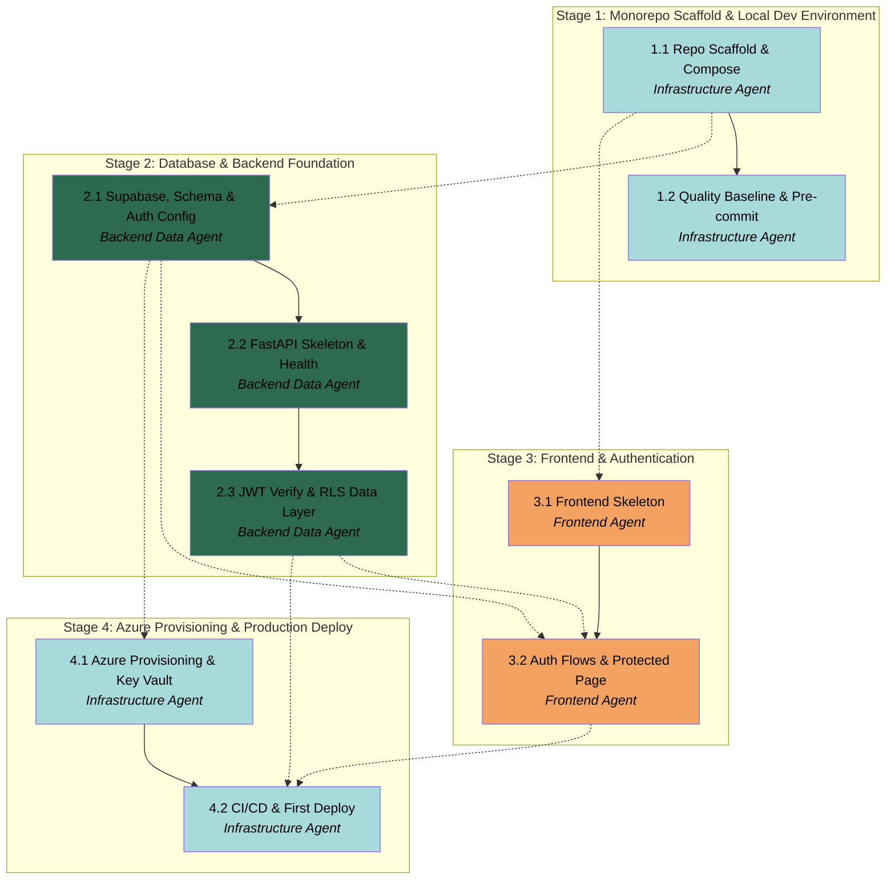

# APM Plan

## Workers

| Worker | Domain | Description |
|---|---|---|
| Infrastructure Agent | DevOps / Cloud / Tooling | Monorepo scaffold, Docker Compose, shared dev tooling and pre-commit/secret-scanning, Azure provisioning via `az` CLI, Key Vault, GitHub Actions CI/CD, first production deploy. |
| Backend Data Agent | Backend / Database / Security | Supabase projects + `profiles` schema/RLS/trigger + Auth config, FastAPI skeleton, Supabase JWT verification, asyncpg pool + per-request RLS data layer, protected endpoints, backend tests. |
| Frontend Agent | Frontend / Client Auth | React + Vite + TS + Tailwind + shadcn/ui skeleton (dark mode), routing, i18n scaffold, Supabase Auth flows, protected-route guard, Hello-{user} page, Vitest. |

## Stages

| Stage | Name | Tasks | Agents |
|---|---|---|---|
| 1 | Monorepo Scaffold & Local Dev Environment | 2 | Infrastructure Agent |
| 2 | Database & Backend Foundation | 3 | Backend Data Agent |
| 3 | Frontend & Authentication | 2 | Frontend Agent |
| 4 | Azure Provisioning & Production Deploy | 2 | Infrastructure Agent |

## Dependency Graph

---

> **Notes:**
> - **Critical path:** 1.1 → 2.1 → 2.2 → 2.3 → 3.2 → 4.2. Backend & Data (Stage 2) is the heaviest and most security-critical stretch; Task 2.3 (JWT verify + per-request RLS wrapper) is the single highest-risk deliverable and the security boundary for every later session — worth the Manager's closest review.
> - **Genuine early-start / parallel opportunities:** Task 3.1 (frontend skeleton) depends only on the repo scaffold (1.1) and can proceed alongside Stage 2. Task 4.1 (Azure provisioning) needs only the Supabase secrets (2.1) and the known env shape, so it can begin before the frontend is finished. Everything else is a real sequential dependency, not an artifact of structuring.
> - **User-in-the-loop Tasks (cannot be fully autonomously validated — they pause for the User):** 2.1 (create Supabase projects, Google OAuth client, enable providers), 4.1 (run `az` provisioning), 4.2 (set GitHub secrets, trigger, verify production). Workers author exact commands and teach live; the User executes the authenticated actions. The Worker model preference (Fable → Opus → Sonnet 5) is in the Spec notes.
> - **Holistic verification worth doing at runtime (Manager's call, not a planned Task):** an end-to-end acceptance check after Stage 4 against the Spec's Definition of Done (signup → verify → login email+Google → protected page shows email → reset → logout, in production, unauthenticated blocked, security headers present). Also a Stage 2 seam check that the RLS `SET LOCAL` claims exactly match the policy predicates before the frontend builds on them.
> - **Minimal-schema divergence** from `docs/APM_SESSIONS.md` (profiles only) is intentional (Spec notes) and should be recorded in `docs/DECISIONS.md` during the session.

## Stage 1: Monorepo Scaffold & Local Dev Environment

### Task 1.1: Repo Scaffold & Compose - Infrastructure Agent

* **Objective:** Stand up the monorepo directory structure and local Docker Compose orchestration that every later Task builds into.
* **Output:** Top-level directories per `docs/APP_DESCRIPTION.md` §7 (`frontend/`, `backend/`, `extension/` placeholder with a README stub, `infra/azure/`, `infra/supabase/`, `.github/workflows/`); root `docker-compose.yml` orchestrating frontend + backend (per §8.2); `backend/.env.example` and `frontend/.env.example` templates (per §8.3); updated root `README.md` with local-dev quickstart. `.gitignore` already exists.
* **Validation:** Directory tree matches §7; `docker compose config` parses without error; `.env.example` files enumerate every variable named in §8.3 with empty/placeholder values and no real secrets; committed on a `chore/` or `feat/` branch.
* **Guidance:** Follow the repository structure in `docs/APP_DESCRIPTION.md` §7 exactly. Compose service definitions and ports per §8.2 (backend 8000, frontend 5173, hot-reload volume mounts). The `extension/` directory is a placeholder only this session (Session 6). Do not create app source yet — that is Tasks 2.2/3.1; this Task creates the skeleton and shared root files. Keep secrets out of `.env.example`.
* **Dependencies:** None

1. Create the top-level directory tree per §7, with placeholder `.gitkeep`/`README` stubs where a directory would otherwise be empty.
2. Author root `docker-compose.yml` with `backend` and `frontend` services per §8.2 (build contexts, ports, env_file, hot-reload volumes, commands).
3. Author `backend/.env.example` and `frontend/.env.example` listing every variable from §8.3 with placeholder values.
4. Update `README.md` with the clone → `cp .env.example` → `docker compose up` local workflow.
5. Run `docker compose config` to confirm the file parses; commit on a feature branch.

### Task 1.2: Quality Baseline & Pre-commit - Infrastructure Agent

* **Objective:** Establish the shared developer quality guardrails (formatting, linting, secret scanning) as a pre-commit framework the whole monorepo inherits.
* **Output:** `.pre-commit-config.yaml` wiring `black`, `ruff`, `prettier`, `eslint`, and a secret-scanning hook (e.g., `detect-secrets` or `gitleaks`); shared base config where sensible (`.editorconfig`, root `prettier`/`eslint` base); a short `docs/` or README note on installing/using pre-commit.
* **Validation:** `pre-commit install` succeeds and `pre-commit run --all-files` executes without configuration errors (language-specific hooks may no-op until each app's config lands); the secret-scanning hook **blocks a deliberately planted fake secret** in a scratch commit attempt and passes once removed.
* **Guidance:** Per `docs/APP_DESCRIPTION.md` §12.4 and the quality-baseline decision in `.apm/spec.md`. Configure Python hooks (`black`, `ruff`) against `backend/` and JS/TS hooks (`prettier`, `eslint`) against `frontend/`; these hooks run in pre-commit's own isolated environments, so they can exist before the app configs and will fully activate once Tasks 2.2 (backend `ruff`/`black`/`mypy` config) and 3.1 (frontend `eslint`/`prettier`/`tsconfig`) land. Prefer widely-used hook repos with pinned revisions (supply-chain hygiene, `docs/ENGINEERING_STANDARDS.md` §B).
* **Dependencies:** Task 1.1

1. Add `.pre-commit-config.yaml` with pinned hook revisions for black, ruff, prettier, eslint, and secret scanning.
2. Add shared base config (`.editorconfig`, root prettier/eslint base) that app configs can extend.
3. Document `pre-commit install` and usage in the README/`docs`.
4. Verify by planting a fake secret in a scratch file and confirming the hook blocks the commit; remove it and confirm a clean run.

## Stage 2: Database & Backend Foundation

### Task 2.1: Supabase Projects, Schema & Auth Config - Backend Data Agent

* **Objective:** Create the dev and prod Supabase projects, the minimal `profiles` schema with RLS and auto-create-on-signup, and the Auth provider configuration that both backend and frontend depend on.
* **Output:** `subscription-auditor-dev` and `subscription-auditor-prod` Supabase projects (User-created); Supabase CLI initialized in the repo; a versioned migration creating `profiles` (columns per `docs/APP_DESCRIPTION.md` §5.1), enabling RLS with per-operation policies (pattern §5.2), and a trigger/function auto-creating a `profiles` row on `auth.users` insert; migration applied to dev (and prod); Supabase Auth configured (email confirmation required, Google provider enabled with a User-created Google Cloud OAuth client); local `backend/.env` populated with dev credentials (gitignored).
* **Validation:** Migration applies cleanly to the dev project via the Supabase CLI; RLS is enabled on `profiles`; signing up a test user auto-creates exactly one `profiles` row; a query as user A cannot read user B's profile row (RLS denial verified); email-confirmation is required on signup; a Google sign-in reaches Supabase successfully (User-confirmed). **User involvement required:** creating both Supabase projects, creating the Google OAuth client, enabling providers, and supplying keys.
* **Guidance:** Schema columns/constraints per `docs/APP_DESCRIPTION.md` §5.1 (`profiles`) and RLS pattern §5.2 — do **not** create any other §5 table (minimal-schema decision in `.apm/spec.md`). Use the Supabase CLI migration workflow (dev→prod) per `.apm/spec.md` "Database & Migrations". The auto-create trigger is the standard `handle_new_user` pattern on `auth.users`. Capture the exact secret names from §8.3 (`SUPABASE_URL`, `SUPABASE_ANON_KEY`, `SUPABASE_SERVICE_ROLE_KEY`, `SUPABASE_JWT_SECRET`, `DATABASE_URL`). This Task involves external-platform actions the User performs with the Worker guiding live — prepare exact console/CLI steps. Record the minimal-schema divergence in `docs/DECISIONS.md`.
* **Dependencies:** **Task 1.1 by Infrastructure Agent** (repo scaffold to hold `infra/supabase/` migrations and Supabase CLI config)

1. Guide the User to create the dev and prod Supabase projects; capture URLs and keys into `backend/.env` (dev) and note prod values securely.
2. Initialize the Supabase CLI in the repo and author the `profiles` migration: table, RLS enable, per-operation policies, and the `handle_new_user` trigger/function.
3. Apply the migration to dev via the CLI; verify RLS and the auto-create trigger with a test signup.
4. Guide the User to create a Google Cloud OAuth client and enable the Google provider + email confirmation in Supabase Auth.
5. Verify cross-user RLS denial and Google sign-in reachability; add the divergence note to `docs/DECISIONS.md`.

### Task 2.2: FastAPI Skeleton & Health - Backend Data Agent

* **Objective:** Stand up the FastAPI backend skeleton with strict layering, configuration, and liveness/readiness endpoints.
* **Output:** `backend/pyproject.toml` + `uv.lock` (uv-managed); `app/main.py`, `app/config.py` (Pydantic Settings), and the `routers/`, `services/`, `db/` package skeleton per §7; `backend/Dockerfile`; `GET /health` (liveness) and `GET /ready` (readiness with a DB ping); `ruff`/`black`/`mypy` (loose) config.
* **Validation:** `uv run uvicorn app.main:app` boots locally; `GET /health` returns 200; `GET /ready` returns 200 when the dev DB is reachable and non-200 when not; the Docker image builds; `ruff`/`black`/`mypy` pass on the backend.
* **Guidance:** Enforce the `routers/`→`services/`→`db/` layering with no leakage per `docs/ENGINEERING_STANDARDS.md` §A and `.apm/spec.md` "Backend Architecture & Data Layer". Config comes from environment only (Pydantic Settings) — no hardcoded values. API is versioned under `/api/v1` (§6). The `/ready` DB ping uses the asyncpg connection established here (pool wiring is completed in 2.3). Stack per `docs/APP_DESCRIPTION.md` §4.2. This is the first FastAPI/uv/Docker introduction — teach these concepts per the Rules before using them.
* **Dependencies:** Task 2.1 (dev `DATABASE_URL` for the `/ready` ping)

1. Initialize the backend with `uv` (`pyproject.toml`, dependencies, `uv.lock`); add `ruff`/`black`/`mypy` config.
2. Create the layered package structure (`routers/`, `services/`, `db/`, `models/`, `config.py`, `main.py`) per §7.
3. Implement `config.py` with Pydantic Settings reading `.env`; implement `/health` and `/ready` (DB ping).
4. Author `backend/Dockerfile`.
5. Verify boot, both endpoints, image build, and linters.

### Task 2.3: JWT Verification & RLS Data Layer - Backend Data Agent

* **Objective:** Implement the security core — Supabase JWT verification, the asyncpg pool with per-request RLS enforcement, a protected profile endpoint, security headers, and auth rate limiting — with tests.
* **Output:** `app/deps.py` with a FastAPI dependency verifying the Supabase JWT against JWKS and extracting `user_id`; `app/db/client.py` with an asyncpg pool and a per-request helper that opens a transaction and runs `SET LOCAL request.jwt.claims = <claims>` + `SET LOCAL role = 'authenticated'`; a protected `GET /api/v1/me` returning the authenticated user's profile/email via that helper; security-headers middleware (CSP, HSTS, `X-Content-Type-Options`, `X-Frame-Options: DENY`, `Referrer-Policy`); per-IP rate limiting on auth-adjacent endpoints; `pytest` suite.
* **Validation:** A valid Supabase JWT to `/api/v1/me` returns 200 with the caller's own email; an invalid/expired/malformed token returns 401 with a generic message (no user-enumeration oracle); **a token for user A cannot read user B's profile** (RLS denial through the `SET LOCAL` path, verified by test); all listed security headers appear on responses; the rate limiter rejects beyond the configured per-IP threshold; `pytest` passes in CI. All queries are parameterized (no string-built SQL).
* **Guidance:** This is the highest-risk deliverable and the security boundary for all later sessions — implement per `.apm/spec.md` "Backend Architecture & Data Layer" and "Security & Privacy Baseline", and `docs/ENGINEERING_STANDARDS.md` §B. The `SET LOCAL request.jwt.claims` value must exactly match what the `profiles` RLS policies read via `auth.uid()` — coordinate the claims shape with the policies authored in 2.1. Use `hmac.compare_digest`-style constant-time comparisons where secret comparison arises (foundation for extension tokens later). JWKS verification per `docs/APP_DESCRIPTION.md` §10.1. Teach JWT verification, RLS-in-app, and the FastAPI dependency concept before implementing.
* **Dependencies:** Task 2.2, Task 2.1 (RLS policies + `SUPABASE_JWT_SECRET`/JWKS)

1. Implement the JWT-verification dependency (`deps.py`) against Supabase JWKS; extract and validate claims; generic 401 on failure.
2. Implement the asyncpg pool and the per-request RLS transaction helper (`SET LOCAL` claims + role) in `db/client.py`.
3. Implement protected `GET /api/v1/me` using the helper to fetch the caller's profile.
4. Add security-headers middleware and per-IP auth rate limiting.
5. Write `pytest` tests: health, valid/invalid token, and cross-user RLS denial; confirm green.

## Stage 3: Frontend & Authentication

### Task 3.1: Frontend Skeleton - Frontend Agent

* **Objective:** Stand up the React + Vite + TypeScript frontend skeleton with Tailwind, shadcn/ui, dark mode, routing, i18n scaffold, and server-state tooling.
* **Output:** `frontend/` Vite + React 18 + TS (`strict: true`) project; Tailwind + shadcn/ui configured with **dark mode as default**; React Router v6 shell; `react-i18next` scaffold with `en` + `el` locale files and keyed UI strings; TanStack Query provider; `src/lib/supabase.ts` (Supabase client), `src/lib/api.ts` (backend client); `eslint`/`prettier`/`tsconfig` strict config; `frontend/Dockerfile`.
* **Validation:** `npm run dev` serves the app; dark mode is the default theme; `npm run lint` and `npm run build` pass with `strict: true`; routes render; the Docker image builds; UI strings are read through i18n keys (no hardcoded display strings in the shell).
* **Guidance:** Stack and design principles per `docs/APP_DESCRIPTION.md` §4.1 and §12.5 (dark-mode-first, shadcn/ui over custom, TanStack Query for server state — never raw `useEffect + fetch`). This is the first Vite/Tailwind/shadcn/React introduction — teach these concepts per the Rules before using them. No auth logic yet (that is 3.2); this Task is the shell, theming, routing, i18n, and client libs.
* **Dependencies:** **Task 1.1 by Infrastructure Agent** (repo scaffold)

1. Initialize the Vite React-TS project in `frontend/`; enable `strict: true`; add `eslint`/`prettier`.
2. Configure Tailwind + shadcn/ui with dark mode as the default target.
3. Set up React Router v6 shell, `react-i18next` (en/el) with keyed strings, and the TanStack Query provider.
4. Add `src/lib/supabase.ts` and `src/lib/api.ts` (reading `VITE_*` env vars); author `frontend/Dockerfile`.
5. Verify dev serve, lint, build, and image build.

### Task 3.2: Auth Flows & Protected Page - Frontend Agent

* **Objective:** Implement the full Supabase Auth surface, the protected-route guard, and the Hello-{user} page that renders the authenticated user's email fetched from the backend.
* **Output:** Signup (with email verification), email/password login, Google OAuth login, password reset, "remember me" (persistent session), logout; a protected-route guard redirecting unauthenticated users; a protected Hello-{user} page fetching the user's email from backend `GET /api/v1/me` via the API client + TanStack Query; wired `frontend/.env.local` (`VITE_*`); a Vitest smoke test.
* **Validation:** Locally (against the dev Supabase project and the local backend) the complete cycle works: signup → email verification → login (email/password **and** Google) → protected page displays the user's own email → password reset → logout; unauthenticated access to the protected page redirects to login; `npm run test` (Vitest) passes. **User involvement:** confirming the Google sign-in end-to-end (depends on the Google OAuth client from 2.1).
* **Guidance:** Use `@supabase/supabase-js` for all flows per `docs/APP_DESCRIPTION.md` §2.8; keep auth as Bearer JWT in the `Authorization` header when calling the backend — never cookies (`docs/ENGINEERING_STANDARDS.md` §B/CSRF). The Hello page must fetch the email from the backend `/me` endpoint (exercising the full JWT→RLS path), not read it only from the client session. Localize all strings via i18n. Teach the Supabase Auth flow, protected routing, and session persistence concepts before implementing.
* **Dependencies:** Task 3.1, **Task 2.1 by Backend Data Agent** (Supabase anon key + Google provider config), **Task 2.3 by Backend Data Agent** (protected `GET /api/v1/me`)

1. Implement signup (email verification), email/password login, Google OAuth login, password reset, and logout via the Supabase client.
2. Implement "remember me" persistent-session handling.
3. Implement the protected-route guard and the Hello-{user} page fetching email from `/api/v1/me` via TanStack Query.
4. Wire `frontend/.env.local` `VITE_*` values; add a Vitest smoke test.
5. Verify the full auth cycle locally against dev Supabase + local backend, including Google sign-in with the User.

## Stage 4: Azure Provisioning & Production Deploy

### Task 4.1: Azure Provisioning & Key Vault - Infrastructure Agent

* **Objective:** Provision the Azure resources and load production secrets into Key Vault via documented `az` CLI steps the User runs.
* **Output:** `infra/azure/README.md` with the exact, ordered `az` commands (and rationale) to provision, for both a resource group and the components: Container Registry (Basic), Container Apps environment + backend app (consumption, `minReplicas: 0`), Static Web Apps (frontend), Key Vault with backend secrets loaded and referenced by the Container App, Application Insights (**provisioned only**, not instrumented). Provisioned live resources (User-executed).
* **Validation:** All resources exist (User confirms via `az`/Portal); Key Vault holds the required backend secrets (Supabase keys, JWT secret, `DATABASE_URL`, VAPID placeholders deferred) and the Container App references them; the Container App can authenticate to and pull from ACR; the `infra/azure/README.md` commands are reproducible for a second (prod) environment. **User involvement required:** the User runs all `az` commands with the Worker guiding live.
* **Guidance:** Documented `az` CLI approach per `.apm/spec.md` "Infrastructure & Deployment" (Bicep deferred). Scale-to-zero (`minReplicas: 0`) per `docs/APP_DESCRIPTION.md` §9.1. App Insights resource is created now but **structured-log wiring is Session 7** — do not instrument. Secrets come only from Key Vault in prod; nothing secret committed. Only the secret names known this session are loaded (Supabase + JWT + DB URL). This Task is guided/User-driven — author precise, explained commands and teach the Azure concepts (Container Apps, ACR, Key Vault references) before the User runs them.
* **Dependencies:** **Task 2.1 by Backend Data Agent** (the secret values to load into Key Vault)

1. Author `infra/azure/README.md` with ordered, explained `az` commands for resource group + all resources.
2. Guide the User to provision ACR, Container Apps env + backend app (scale-to-zero), Static Web Apps, App Insights.
3. Guide the User to create Key Vault, load backend secrets, and wire Container App secret references.
4. Verify resource existence, ACR pull access, and Key Vault references with the User.

### Task 4.2: CI/CD & First Deploy - Infrastructure Agent

* **Objective:** Wire GitHub Actions to build/test/deploy both apps and execute the first end-to-end production deploy meeting the Definition of Done.
* **Output:** `.github/workflows/backend.yml` (run `pytest` → build Docker → push to ACR → update Container App revision) and `.github/workflows/frontend.yml` (lint → build → Vitest → deploy to Static Web Apps) per `docs/APP_DESCRIPTION.md` §9.2; documented GitHub Actions secrets; first successful production deploy; production verification notes.
* **Validation:** A push to `main` triggers both workflows to green; the production frontend URL serves the app; in production the full Definition-of-Done auth flow works (signup → email verification → login email+Google → protected page shows the user's email → password reset → logout); unauthenticated access is blocked in prod; the security headers from 2.3 are present on production backend responses. **User involvement:** setting GitHub secrets, triggering the deploy, and confirming the production behavior.
* **Guidance:** Workflows per `docs/APP_DESCRIPTION.md` §9.2; `extension.yml` is deferred to Session 6. Frontend build-time `VITE_*` values come from GitHub Actions secrets; backend runtime secrets from Key Vault (from 4.1). CI reuses the same lint/test configured in Stages 1–3. This closes the session — run the end-to-end acceptance against `.apm/spec.md` "Definition of done" with the User. Teach the GitHub Actions / CI-CD concepts before wiring.
* **Dependencies:** Task 4.1, **Task 2.3 by Backend Data Agent** (tested backend + Dockerfile + security headers), **Task 3.2 by Frontend Agent** (working frontend auth + build)

1. Author `backend.yml`: `pytest` → Docker build → ACR push → Container App revision update.
2. Author `frontend.yml`: lint → build → Vitest → Static Web Apps deploy.
3. Document and guide the User to set the required GitHub Actions secrets.
4. Trigger the first deploy from `main`; confirm both workflows go green.
5. Run the production Definition-of-Done acceptance with the User (auth flows, unauthenticated block, security headers).
