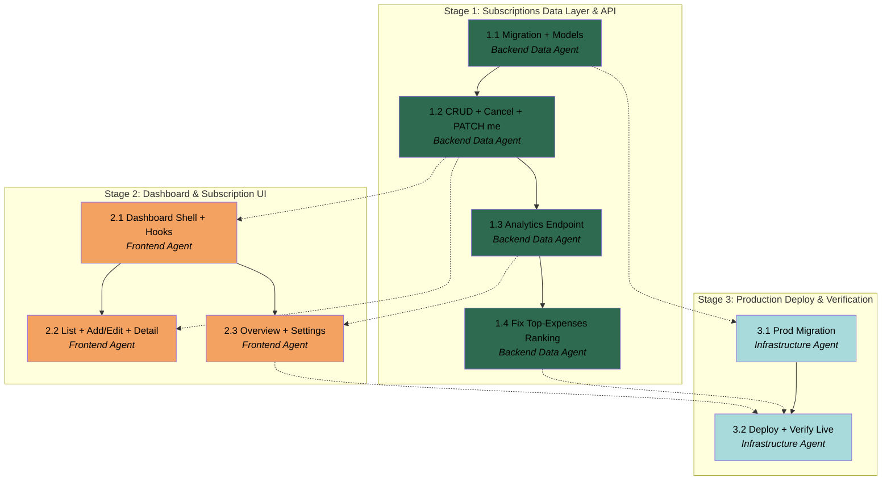

# APM Plan

## Workers

| Worker | Domain | Description |
|---|---|---|
| Backend Data Agent | Database + FastAPI backend | Owns the `subscriptions` migration, Pydantic models, CRUD/analytics/`PATCH me` endpoints, service-layer logic (renewal-date + money normalization), and the pytest suite incl. the cross-user RLS-denial test. |
| Frontend Agent | React frontend | Owns the dashboard shell + tabs, subscription list/detail/add-edit UI, Overview charts (Recharts), Settings wiring, i18n keys, and Vitest tests. |
| Infrastructure Agent | Supabase + Azure + CI/CD | Applies the migration to prod Supabase and drives the production deploy and live end-to-end verification. |

## Stages

| Stage | Name | Tasks | Agents |
|---|---|---|---|
| 1 | Subscriptions Data Layer & API | 3 | Backend Data Agent |
| 2 | Dashboard & Subscription UI | 3 | Frontend Agent |
| 3 | Production Deploy & Verification | 2 | Infrastructure Agent |

## Dependency Graph

---

> **Notes:**
> - Critical path: 1.1 → 1.2 → 2.1 → 2.3 → 3.2. The two cross-agent convergence points are the API contract (concrete once 1.2 lands) and the analytics payload (1.3). Once 1.2 is merged, the Frontend Agent can proceed; 2.2 and 2.3 both branch off 2.1 and can be dispatched as a same-agent batch or, if desired, 2.2 first (core CRUD) then 2.3.
> - Stage 1's three Tasks are a natural same-agent sequential batch. Stage 3's two Tasks likewise, but with heavy User coordination — both involve real prod credentials and live human verification; they are not autonomously completable.
> - Stage boundaries are good holistic-verification points. End of Stage 1: backend fully testable via pytest + Swagger with no UI. End of Stage 2: app usable locally against dev Supabase. End of Stage 3 = the session Definition of Done (live prod flow), mirroring the S1 production DoD walkthrough that caught five prod-only gaps — the Manager should run a similar live checklist.
> - Inherited lesson (S1): dev and prod Supabase are independent; the prod migration (3.1) MUST precede the backend deploy (3.2) or the live backend 500s against a missing table. Also: merging to `main` is what fires CI — verification of the deploy happens after the merge, not before.
> - Extensibility is an explicit User priority: Stage 1 establishes the first `subscriptions` slice that later sessions copy — keep the vertical-slice + strict-layering shape clean.

## Stage 1: Subscriptions Data Layer & API

### Task 1.1: Subscriptions Migration + Pydantic Models - Backend Data Agent

* **Objective:** Create the `subscriptions` table (schema, enums, RLS, indexes) and the Pydantic request/response models that form the Session-2 API contract.
* **Output:** New timestamped migration under `supabase/migrations/` (e.g. `<ts>_create_subscriptions_table.sql`); `backend/app/models/subscription.py` (create/update/response/list-response models); migration applied to the **dev** Supabase project.
* **Validation:** Migration applies cleanly to dev Supabase; the table has the trimmed column set with `CHECK` constraints on `category`/`billing_cycle`/`status`, `price >= 0`, RLS **enabled** with four `auth.uid() = user_id` policies (SELECT/INSERT-with-check/UPDATE/DELETE), and the two indexes; Pydantic models accept a valid payload and reject invalid enum values, negative price, over-length strings, and malformed dates (quick unit check or REPL). User confirms the dev migration applied.
* **Guidance:** Follow the exact pattern in `supabase/migrations/20260704152946_create_profiles_table.sql` for RLS/policy structure. Schema, enum values (note `billing_cycle` excludes `custom` this session), column list, and index targets are defined in the Spec "Data Model — `subscriptions` table (trimmed)" section — implement exactly that, do not add the deferred columns. Models use `Literal[...]` for enums (parity with DB CHECKs — defense in depth per `ENGINEERING_STANDARDS.md` §B), field length caps, and `>= 0` price constraint; response model returns all Session-2 columns. Applying to dev is a User-driven step (`supabase db push` or dashboard) — prepare exact commands and pause per the external-platform rule in `CLAUDE.md`. **Teach before building:** the migration/RLS-policy pattern and Pydantic `Literal`/constraint validation as they are used.
* **Dependencies:** None.

1. Write the `subscriptions` migration SQL (table + enum CHECKs + `price >= 0` + RLS enable + four policies + two indexes), mirroring the `profiles` migration structure.
2. Prepare the exact command(s) to apply the migration to the dev Supabase project; pause for the User to run them and report success.
3. Create `app/models/subscription.py` with create/update (partial)/response/list-response Pydantic models using `Literal` enums, length caps, and the price constraint.
4. Quickly verify the models accept a valid payload and reject each invalid case (bad enum, negative price, over-length, bad date).
5. Append a `docs/LEARNING_LOG.md` entry for the new concepts (subscriptions RLS migration, Pydantic constraint/`Literal` validation) with a code pointer.

### Task 1.2: Subscriptions CRUD + Cancel + PATCH /me + Tests - Backend Data Agent

* **Objective:** Implement the full subscriptions read/write API (list/create/get/update/delete/cancel) with the hybrid renewal-date logic, extend `/me` with `PATCH`, and cover it with pytest including the cross-user RLS-denial test.
* **Output:** `app/db/subscriptions.py` (parameterized asyncpg queries), `app/services/subscription.py` (business logic incl. renewal-date computation), `app/routers/subscriptions.py` (the six endpoints), `PATCH /me` added to `app/routers/me.py` + `app/services/profile.py`, routers registered in `app/main.py`; pytest in `backend/tests/` (`test_subscriptions.py`, RLS-denial case, `PATCH /me` case).
* **Validation:** `pytest` green, including: create/read/update/delete/cancel happy paths; validation rejections (bad enum, negative price, over-length) return 422; pagination/filter/sort behave; **a real-DB cross-user test proves user B cannot read or modify user A's subscription (RLS denial)**; `PATCH /me` updates display-name/language. Manual Swagger check of each endpoint. `user_id` is taken only from JWT claims, never from request bodies.
* **Guidance:** Strict layering per `ENGINEERING_STANDARDS.md` §A: router (HTTP only) → service (logic) → db (asyncpg). All queries through `rls_connection(claims)` (see `app/db/rls.py`) and parameterized (never f-strings). Mirror the `profiles` vertical slice (`app/db/profiles.py`, `app/services/profile.py`, `app/routers/me.py`). Endpoint contracts, pagination limits (default 50 / max 100), filters, sort fields, and cancel-vs-delete semantics are in the Spec "API Surface" section; renewal-date hybrid rule in "Renewal Date Semantics" — the computation is a pure service helper, unit-testable. RLS-denial test follows the existing `backend/tests/test_rls.py` pattern. **Teach before building:** the layered write path, `rls_connection` transaction scoping, and why the RLS-denial test matters.
* **Dependencies:** Task 1.1 (migration + models).

1. Implement `app/db/subscriptions.py` — parameterized CRUD queries (list with filter/sort/pagination, get, insert, update, delete, cancel-update), all executed on the RLS-scoped connection.
2. Implement `app/services/subscription.py` — CRUD orchestration + the pure renewal-date computation helper (user value wins; else roll `start_date` forward by cycle until future).
3. Implement `app/routers/subscriptions.py` — the six endpoints using `get_current_claims`, returning the Pydantic response models; register the router in `app/main.py`.
4. Add `PATCH /me` (service + router) updating `display_name` / `preferred_language`.
5. Write pytest: CRUD happy paths, 422 validation rejections, pagination/filter/sort, `PATCH /me`, and the cross-user RLS-denial test (per `test_rls.py`).
6. Run `pytest` to green; do a manual Swagger pass; append `docs/LEARNING_LOG.md` concepts + pointers.

### Task 1.3: Analytics Endpoint + Money Normalization - Backend Data Agent

* **Objective:** Implement the Overview analytics endpoint and the shared money-normalization helper (active-only, cycle-normalized, per-currency), with unit tests.
* **Output:** money-normalization helper (in `app/services/`, e.g. `analytics.py`), analytics aggregation query(ies) in `app/db/`, `GET /subscriptions/analytics` endpoint + analytics response model, unit tests in `backend/tests/` (`test_analytics.py`).
* **Validation:** Unit tests prove: billing-cycle normalization to monthly-equivalent (weekly ×52/12, monthly ×1, quarterly ÷3, yearly ÷12); **active-only** exclusion of cancelled/paused; **per-currency grouping** with no FX conversion; correct monthly burn, annualized (×12), top expenses (sorted desc, capped), upcoming renewals (next 30 days). Endpoint returns the agreed shape and matches hand-computed fixtures. Empty-portfolio case returns well-formed zeros/empties (no crash).
* **Guidance:** Money-aggregation rules are fully specified in the Spec "Money Aggregation Semantics" section — implement exactly (literal per-sub is a frontend concern; this endpoint returns normalized roll-ups). Prefer SQL aggregation in the `db/` layer, assembled in the service; the normalization factors can be applied in SQL or in the service helper — keep the factor logic in one unit-tested place. Active-only filter is `status='active'`. All through `rls_connection`. **Teach before building:** SQL aggregation vs in-Python rollup tradeoff, and why per-currency grouping (not FX) is the honest choice.
* **Dependencies:** Task 1.2 (subscriptions data layer).

1. Implement the money-normalization helper (cycle → monthly-equivalent factor) as a single pure, unit-tested function.
2. Implement the analytics aggregation in `app/db/` (active-only, grouped by currency and by category) and assemble the Overview payload in the service.
3. Add `GET /subscriptions/analytics` + its Pydantic response model; register as needed.
4. Write `test_analytics.py` covering normalization, active-only, per-currency grouping, top-expenses, upcoming-renewals, and the empty-portfolio case.
5. Run `pytest` to green; append `docs/LEARNING_LOG.md` concept + pointer.

### Task 1.4: Fix Cross-Currency Top-Expenses Ranking - Backend Data Agent

* **Objective:** Fix a correctness bug discovered after Task 1.3 was marked Done: `top_expenses` ranks active subscriptions by raw `monthly_equivalent` across **all** currencies mixed together, which is meaningless (e.g. a ¥3000 subscription currently outranks a €50 one purely on numeric magnitude, ignoring that they're different currencies). This contradicts the project's own "currency grouped, never converted" principle that already governs every other analytics field (`monthly_burn_by_currency`, `annual_projection_by_currency`, `spend_by_category`) — `top_expenses` was the one field that didn't follow it.
* **Output:** Corrected ranking logic in `backend/app/services/analytics.py`; updated/added test coverage in `backend/tests/test_analytics.py` proving the fix.
* **Validation:** With active subscriptions spanning 2+ currencies (e.g. several EUR items and several JPY items with a JPY item numerically larger than a EUR item), `top_expenses` returns the top 5 **within each currency**, not a single global top-5 blind to currency — a large-magnitude item in one currency must never crowd out a genuinely top item in another currency. Existing single-currency test cases still pass unchanged. Full `pytest` suite green.
* **Guidance:** The bug is in `build_overview()` in `backend/app/services/analytics.py` — `ranked = sorted(...)[:TOP_EXPENSES_LIMIT]` sorts `get_active_for_ranking()` rows globally instead of per-currency. Fix by grouping the ranking candidates by `currency` first, then applying the existing sort key (`-monthly_equivalent` desc, `name` asc) and `TOP_EXPENSES_LIMIT` cap **within each currency group**, then concatenating (sort the concatenation by currency for deterministic output). This is a logic-only fix — the `TopExpense` Pydantic model already carries a `currency` field per item and `AnalyticsResponse.top_expenses` stays a flat `list[TopExpense]`, so **no API contract change and no frontend follow-up is needed** (the frontend already paginates this list generically). Do not change the response shape to a per-currency dict — that would be a breaking change to already-shipped frontend code for no added benefit given the per-item `currency` field already disambiguates.
* **Dependencies:** Task 1.3 (already Done — this corrects its output).

1. Group `get_active_for_ranking()` rows by `currency`, apply the existing `monthly_equivalent` sort key and `TOP_EXPENSES_LIMIT` cap within each group, concatenate sorted by currency.
2. Add a multi-currency test case to `test_analytics.py` proving a numerically-larger item in one currency does not crowd out a top item in another currency; confirm existing single-currency cases still pass.
3. Run `pytest` to green.

## Stage 2: Dashboard & Subscription UI

### Task 2.1: Dashboard Shell, Tabs, shadcn Components & Data Hooks - Frontend Agent

* **Objective:** Replace the flat Dashboard with a tabbed dashboard shell, add the required shadcn components, and stand up the TanStack Query hooks + API calls for subscriptions and analytics.
* **Output:** Dashboard layout/shell under `src/features/dashboard/` (or similar) with tab navigation (Overview, Subscriptions, Detail route, Settings functional; Reports + Chat visible placeholders); routing updated in `src/App.tsx`; new shadcn/Base UI components (`table`, `dialog`, `form`, `select`, `badge`, `card`); TanStack Query hooks (`useSubscriptions`, `useSubscription`, `useAnalytics`, plus mutation hooks) calling the backend via `src/lib/api.ts`; i18n keys scaffolded in `en.json` + `el.json`.
* **Validation:** App builds (`npm run build`) and lints clean; the shell renders in dark mode with all tabs navigable; Reports/Chat are clearly placeholders; hooks successfully fetch from the running backend (dev) with the session token; no raw `useEffect`+fetch (TanStack Query only); all visible strings are i18n keys (no hardcoded copy) present in both locales.
* **Guidance:** Follow existing patterns: `src/hooks/useMe.ts` for query hooks, `src/lib/api.ts::apiFetch` (pass `session.access_token`), `src/features/auth/` for feature-folder structure, react-i18next setup in `src/i18n/`. New shadcn components must use the **Base UI** preset (`render`-prop API), not Radix (per `docs/DECISIONS.md`). Frontend structure (which tabs functional vs placeholder, feature-scoping) is in the Spec "Frontend Structure" section. Consume the API contract exactly as delivered by Stage 1 (endpoints/shapes). **Teach before building:** the dashboard-shell/layout-route pattern, adding a shadcn Base UI component, and the TanStack Query hook pattern for a new resource.
* **Dependencies:** **Task 1.2 by Backend Data Agent** (working subscriptions endpoints + response shapes).

1. Add the shadcn/Base UI components (`table`, `dialog`, `form`, `select`, `badge`, `card`).
2. Build the dashboard shell/layout with tab navigation and restructure routing in `App.tsx` (nested routes for tabs + `/subscriptions/:id` detail); Reports/Chat as placeholder panels.
3. Implement TanStack Query hooks for subscriptions (list/detail), analytics, and mutations (create/update/cancel/delete) against `apiFetch`.
4. Scaffold i18n keys for all new UI surfaces in `en.json` + `el.json`.
5. Verify build + lint clean and hooks fetch from the dev backend; append `docs/LEARNING_LOG.md` concepts + pointers.

### Task 2.2: Subscription List, Add/Edit Dialog & Detail Page - Frontend Agent

* **Objective:** Build the subscription CRUD UI — a sortable/filterable list, a modal add/edit form, cancel/delete actions, and the detail page — with Vitest on the form validation.
* **Output:** Subscription list view (shadcn `table`, sort + filter by status/category, status `badge`, row actions) under `src/features/subscriptions/`; add/edit modal `Dialog` with a react-hook-form + Zod form (create + edit); confirmed cancel + delete actions wired to mutations; subscription detail page (`/subscriptions/:id`) with real info + edit/cancel/delete and **explicit placeholders** for usage chart / heatmap / cost-per-hour; Vitest test(s) for the form's Zod validation.
* **Validation:** Against dev backend: create → appears in list; edit → persists; cancel → status badge flips to cancelled and row remains; delete → row removed; list sorts and filters correctly; the form's Zod schema blocks invalid input (bad/empty required fields, negative price, bad date) before submit; per-sub amounts display **literally** (entered cycle/currency); detail page shows placeholders (no fabricated usage data); Vitest green; build + lint clean; strings i18n-keyed in both locales.
* **Guidance:** Add/edit is a modal `Dialog` (Spec "Frontend Structure"). Zod schema mirrors the backend Pydantic constraints (enums, price ≥ 0, required fields) — UX only; backend is the trust boundary. Currency is a curated ISO-code dropdown, not free text (Spec "Localization"). Per-subscription display is literal — do not normalize on the card (Spec "Money Aggregation Semantics"). Detail-page usage/heatmap/cost-per-hour are Session-6 data — render honest empty/placeholder states, never mock numbers. Reuse the query/mutation hooks from Task 2.1 **and** the `ConfirmDialog` component Task 2.1 built (`features/dashboard/ConfirmDialog.tsx`) for the confirmed cancel/delete actions — do not hand-roll a new confirmation dialog. This project's shadcn/Base UI preset (`base-nova`) has no generated `form` wrapper component — Task 2.1 used the Base UI `field` (+`separator`) primitives instead; build the add/edit form on those, and install `react-hook-form` + `zod` + a resolver package (none are in `package.json` yet) to wire validation — the react-hook-form + Zod Rule still applies, only the backing primitive changed. Money fields from the API (`price`, etc.) serialize as JSON strings (Pydantic `Decimal`), not numbers — convert with `Number(...)` at display/format boundaries, never assume a numeric type from the hooks. **Teach before building:** react-hook-form + Zod wiring without a generated `form` wrapper, and the shadcn Dialog (Base UI) pattern.
* **Dependencies:** Task 2.1 (shell, components, hooks); **Task 1.2 by Backend Data Agent** (CRUD endpoints).

1. Build the subscription list table with sort, status/category filters, status badges, and an Add button.
2. Build the add/edit modal Dialog form (react-hook-form + Zod), wired to create/update mutations; currency as ISO-code dropdown.
3. Wire confirmed cancel and delete actions to their mutations, with TanStack Query cache invalidation.
4. Build the `/subscriptions/:id` detail page (real info + actions + honest S6 placeholders).
5. Write Vitest for the form Zod validation; verify the full CRUD round-trip against dev; append `docs/LEARNING_LOG.md` concepts + pointers.

### Task 2.3: Overview Tab (Recharts) & Settings Wiring - Frontend Agent

* **Objective:** Build the Overview analytics tab with Recharts and wire the Settings tab's profile fields to `PATCH /me`.
* **Output:** Overview tab under `src/features/dashboard/` consuming `useAnalytics`: monthly burn (per currency), annualized projection, upcoming renewals (next 30 days), top expenses, and a spend-by-category **Recharts** chart; Settings tab with display-name + language-preference form (react-hook-form + Zod) wired to a `PATCH /me` mutation, plus **inert** notification-preference UI; localized number/date/currency formatting via `Intl`.
* **Validation:** Overview figures match the backend analytics payload, shown **per currency**, **active-only** (cancelled/paused excluded); the category chart renders and is readable in dark mode; empty-portfolio state renders gracefully (no crash, sensible zeros/empty message); Settings display-name + language changes persist across reload (verified via `PATCH /me` and refetch); notification prefs are visibly present but clearly inactive; numbers/dates/currencies formatted per active language; build + lint + Vitest clean; strings i18n-keyed in both locales.
* **Guidance:** Recharts is first-use in the project — reuse these same chart components later for in-chat charts (S3), so build them cleanly/reusably. Consume the analytics shape from Task 1.3 as-is; do not re-derive money math on the client (the backend already normalized) — the frontend formats/labels only (Spec "Money Aggregation Semantics" + "Localization"). The analytics payload's money fields arrive as JSON strings (Pydantic `Decimal`), not numbers — `Number(...)` them before passing to `Intl.NumberFormat`/Recharts. Use `Intl.NumberFormat`/`Intl.DateTimeFormat` keyed to the active i18n language. Settings notification prefs stay inert (backend in S5). The Settings profile form (display-name + language) has the same tooling constraint as Task 2.2: no generated shadcn `form` wrapper exists in this preset — use the `field` primitive Task 2.1 added, and `react-hook-form`/`zod`/resolver need installing if Task 2.2 hasn't already added them. Reuse the Task 2.1 hooks; add a `PATCH /me` mutation hook. Consult the `dataviz` skill for chart color/legend/axis choices. **Teach before building:** Recharts fundamentals and `Intl` localization.
* **Dependencies:** Task 2.1 (shell, hooks); **Task 1.3 by Backend Data Agent** (analytics endpoint); **Task 1.2 by Backend Data Agent** (`PATCH /me`).

1. Build the Overview tab consuming `useAnalytics`: burn (per currency), annualized, upcoming renewals, top expenses.
2. Build the spend-by-category Recharts chart (dark-mode readable; reusable component).
3. Handle the empty-portfolio state gracefully.
4. Build the Settings profile form (display-name + language) wired to a `PATCH /me` mutation; render inert notification-prefs UI.
5. Apply `Intl` localization to all numbers/dates/currencies; verify build + lint + Vitest; append `docs/LEARNING_LOG.md` concepts + pointers.

### Task 2.4: Currency Filter on the Top-Expenses Card - Frontend Agent

* **Objective:** Add a per-currency filter to the Overview tab's Top-Expenses card, shown only when the portfolio spans more than one currency, mirroring the currency selector already built for the spend-by-category chart card.
* **Output:** A currency `Select` control on the Top-Expenses `Card` in `frontend/src/features/analytics/OverviewPanel.tsx`, visible only when `currencies.length > 1`; selecting a currency filters the top-expenses list to that currency, selecting "All" (the default) shows every currency's items as it does today.
* **Validation:** With a single-currency portfolio, no filter control appears (unchanged from today). With a multi-currency portfolio, a filter control appears on the Top-Expenses card; selecting a specific currency shows only that currency's top-expense items (still ranked/capped per the corrected backend behavior); selecting "All" restores the full mixed-currency list; pagination still behaves correctly against the filtered set; build + lint + Vitest clean; the new control's strings are i18n-keyed in both `en.json`/`el.json`.
* **Guidance:** The spend-by-category chart card in the same file already has exactly this pattern — a `Select`/`SelectContent`/`SelectItem` control with an `ALL` sentinel value, populated from the same `currencies` array already computed via `useMemo` in `OverviewPanel`, defaulting to `ALL`. Reuse that same control shape and the same `currencies` list for consistency — don't invent a second currency-selector style. `data.top_expenses` is a flat list where each item already carries its own `currency` field (the backend's per-currency ranking fix in Task 1.4 didn't change this shape) — filter it client-side by the selected currency before the existing `paginate(...)` call that produces `expenses`; when "All" is selected, pass the unfiltered list through as today. Reset the expenses page to 1 when the currency filter changes, so switching currencies doesn't strand the user on a page that no longer exists for the filtered set.
* **Dependencies:** Task 2.3 (same agent, same feature — the Overview tab and its existing currency-selector pattern already exist).

1. Add local state for the selected top-expenses currency filter (default `ALL`), reusing the existing `currencies` memo.
2. Add the `Select` control to the Top-Expenses `Card`, shown only when `currencies.length > 1`, styled/positioned consistently with the chart card's existing selector.
3. Filter `data.top_expenses` by the selected currency (or pass through unfiltered for `ALL`) before pagination; reset the expenses page on filter change.
4. Add the new control's i18n keys to both locales; verify build + lint + Vitest, and manually confirm the filter behaves correctly against the running dev backend with multi-currency data.

## Stage 3: Production Deploy & Verification

### Task 3.1: Apply Subscriptions Migration to Production Supabase - Infrastructure Agent

* **Objective:** Apply the `subscriptions` migration to the **prod** Supabase project and verify the schema + RLS landed, before any backend deploy hits it.
* **Output:** The `subscriptions` table (with enums, indexes, and RLS policies) present in the **prod** Supabase project; a short note in the deploy record/`docs` confirming prod application.
* **Validation:** In the prod Supabase console/CLI, `subscriptions` exists with the four RLS policies enabled and the CHECK constraints/indexes present; a spot query confirms RLS is on. User confirms prod application (this is a real-credential, User-driven step).
* **Guidance:** Dev and prod Supabase are independent projects (S1 lesson: the prod DB was never migrated → live 500) — applying to dev in Task 1.1 does **not** touch prod. Prepare the exact `supabase` CLI commands (or dashboard steps) targeting the prod project ref; pause for the User to execute and confirm per the external-platform rule in `CLAUDE.md`. Do not proceed to deploy (3.2) until this is confirmed. **Teach before building:** why prod migration is a separate explicit step and the ordering constraint (migrate prod before deploying the backend).
* **Dependencies:** **Task 1.1 by Backend Data Agent** (the migration file).

1. Prepare the exact commands/steps to apply the migration to the prod Supabase project.
2. Pause for the User to run them; confirm success.
3. Verify in the prod console that the table, RLS policies, constraints, and indexes exist; record confirmation.

### Task 3.2: Production Deploy & Live End-to-End Verification - Infrastructure Agent

* **Objective:** Deploy the Session-2 backend + frontend to Azure and verify the full live flow meets the session Definition of Done.
* **Output:** Session-2 code merged to `main` (triggering `backend.yml` + `frontend.yml`); deployed backend (Container App) + frontend (Static Web App); a recorded live-verification checklist result.
* **Validation:** Both GitHub Actions workflows complete green; on the live production site a user can create → see on Overview → edit → cancel → delete a subscription; Overview stats are correct (active-only, per-currency); Settings display-name/language persist; per-user isolation holds (a second account sees none of the first's data); unauthenticated access remains blocked; SSE/no regressions to S1 auth flow. User performs the live walkthrough (human judgment required).
* **Guidance:** Merging to `main` is what fires CI (S1 lesson: you verify after the merge, not before). Ensure Task 3.1 (prod migration) is confirmed first or the live backend will 500 against a missing table. Follow the S1 production-DoD walkthrough approach (`.apm/archives/session-1-foundation/session-summary.md` "Notable Findings") — that live pass caught five prod-only gaps; run a comparable checklist here (Site URL/redirect, CORS origins if changed, env/secrets unchanged). Frontend prod build must point at the prod API base URL. **Teach before building:** the merge-triggers-CI deploy model and the value of a live DoD walkthrough.
* **Dependencies:** Task 3.1 (prod migration applied); **Task 1.3 by Backend Data Agent** (backend code complete); **Task 2.3 by Frontend Agent** (frontend code complete).

1. Confirm Task 3.1 is done (prod migrated); ensure the frontend prod build targets the prod API base URL and no prod settings regressed.
2. Merge the Session-2 work to `main`; monitor `backend.yml` + `frontend.yml` to green.
3. Walk the live end-to-end DoD checklist with the User (create→Overview→edit→cancel→delete; per-user isolation; unauth blocked).
4. Record the verification result and any prod-only gaps found + fixed; append a `docs/LEARNING_LOG.md` note if new deploy concepts surfaced.
