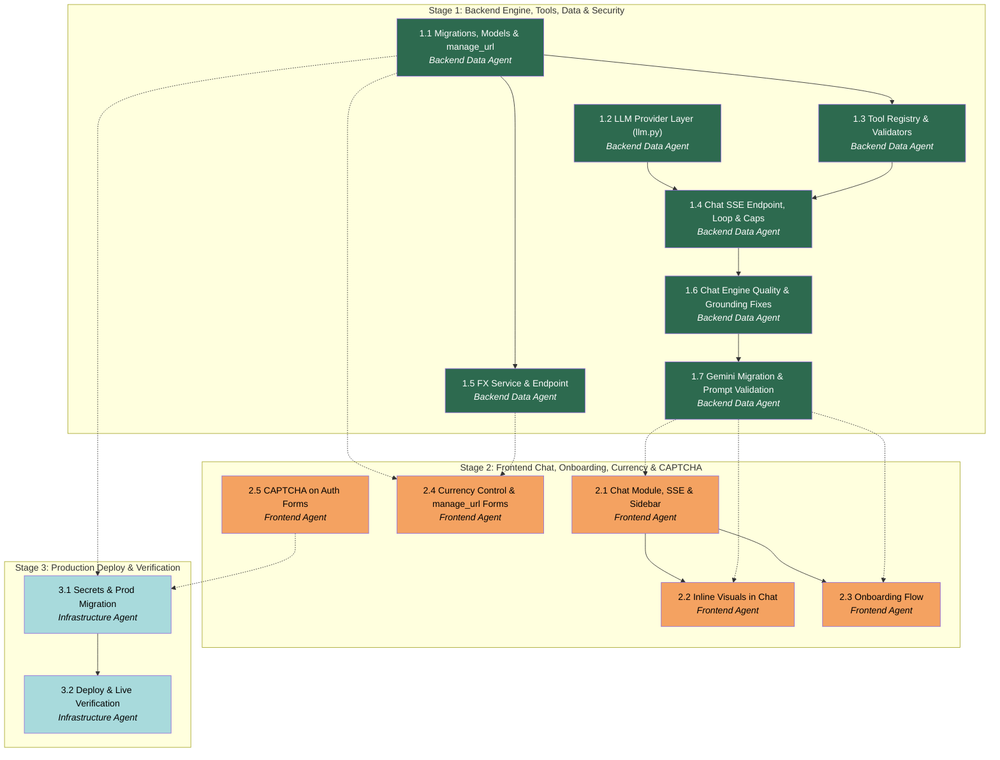

# APM Plan

## Workers

| Worker | Domain | Description |
|---|---|---|
| Backend Data Agent | Backend (FastAPI, asyncpg, LLM, Supabase migrations) | Builds the data layer, the provider-agnostic LLM engine, the tool registry, the SSE chat endpoint with persistence + caps, and the FX service. |
| Frontend Agent | Frontend (React, TypeScript, Recharts, i18n) | Builds the chat UI + SSE consumption, inline visuals, onboarding flow, currency control + manage_url forms, and CAPTCHA on the auth forms. |
| Infrastructure Agent | Deploy (Supabase CLI, Azure, GitHub Actions) | Provisions secrets, applies migrations to prod, deploys, and verifies the live definition of done. |

## Stages

| Stage | Name | Tasks | Agents |
|---|---|---|---|
| 1 | Backend: Chat Engine, Tools, Data Layer & Security | 5 | Backend Data Agent |
| 2 | Frontend: Chat UI, Inline Visuals, Onboarding, Currency & CAPTCHA | 5 | Frontend Agent |
| 3 | Production Deploy & Verification | 2 | Infrastructure Agent |

## Dependency Graph

---

> **Notes:** Stages are sequential — Stage 2 begins after Stage 1's contracts exist, Stage 3 after all
> code is merged. Within each stage the tasks are one worker's, so the Manager batches same-worker
> sequential tasks; the solid edges show the natural batch order. **Dispatch opportunities:** Task 1.1 and
> Task 1.2 are independent roots — either can lead Stage 1. **Task 2.5 (CAPTCHA) has no Stage-1
> dependency** (dev uses Cloudflare Turnstile test keys) and can lead Stage 2 or run whenever convenient.
> Task 2.4 depends on backend Tasks 1.1 + 1.5 but not on 2.1/2.2/2.3, so it can proceed as soon as those
> backend contracts land. **Convergence/critical path:** Task 1.4 is the backbone — three frontend tasks
> gate on it; sequence 1.1/1.2 → 1.3 → 1.4 to unblock the frontend earliest. **Holistic verification
> points worth the Manager's attention:** after Stage 1 (end-to-end a chat message drives a real
> tool-executed, persisted, capped, streamed response on dev — the whole engine, not just unit tests);
> after Stage 2 (the full chat + onboarding + currency + CAPTCHA UX against the live-dev backend); and the
> Stage 3 live DoD walk. **User coordination steps** (flag early): providing `GROQ_API_KEY` for dev
> (Task 1.2) and prod (3.1); relinking the Supabase CLI to dev before the first migration (1.1) and to
> prod for 3.1; obtaining Turnstile keys + enabling Supabase CAPTCHA (2.5 dev / 3.1 prod). Prod migration
> may hit history drift (as in Session 2) — reconcile with `supabase migration repair` before pushing.
> Known pytest flakiness: 1–3 live-DB tests intermittently fail under Supabase free-tier Auth Admin
> rate-limiting — re-run in isolation before treating as a regression.

## Stage 1: Backend — Chat Engine, Tools, Data Layer & Security

### Task 1.1: Migrations, Models & manage_url API - Backend Data Agent

* **Objective:** Create and dev-apply the Session-3 schema (conversations, messages, fx_rates, llm_usage, and the subscriptions.manage_url column) with RLS, plus the Pydantic models and cross-user isolation tests.
* **Output:** New migration SQL file(s) under `supabase/migrations/`; Pydantic models in `backend/app/models/` for conversations/messages (and `manage_url` added to the subscription models); RLS policies + indexes; cross-user RLS-denial tests in `backend/tests/`; `manage_url` wired through the existing subscription create/update/response service + router path.
* **Validation:** Direct dev-Supabase introspection shows every new table/column, exactly the intended RLS policies, and the `(conversation_id, created_at)` index; the cross-user RLS-denial tests pass (a second user cannot read/modify the first user's conversations/messages), following `backend/tests/test_rls.py`; `manage_url` round-trips through create/update/get with URL validation rejecting non-`http(s)`/oversized values (clean 422). User step: confirm the CLI is relinked to dev before the push.
* **Guidance:** Schemas per Spec "Data Model & Persistence" and `docs/APP_DESCRIPTION.md` §5. Mirror the established RLS pattern (`auth.uid() = user_id`, four policies) and Pydantic conventions from `backend/app/models/subscription.py` (Literal enums, length caps, the money-as-Decimal note). `fx_rates` is global reference data — authenticated-read RLS like `service_guides`, no per-user policy; the backend will write it via the service role. `llm_usage` is the DB-backed daily counter design from the Spec (per-user + app-wide day buckets). `manage_url` is Option A (user-provided only) per `docs/DECISIONS.md` 2026-07-09. The Supabase CLI is currently linked to prod — relink to dev (`supabase link --project-ref zocfhyysnvptxktqezfk`) first.
* **Dependencies:** None.

1. Relink the Supabase CLI to dev; confirm with the User.
2. Write the migration(s): `conversations`, `messages` (roles, `tool_calls`/`tool_call_id`/`structured_payload` JSONB, index), `fx_rates`, `llm_usage`, and the `subscriptions.manage_url` column; enable RLS + policies on the user-scoped tables.
3. Add Pydantic models for conversations/messages; add `manage_url` to `SubscriptionCreate/Update/Response` with URL validation; thread it through the subscription service + router.
4. Write cross-user RLS-denial tests for `conversations` and `messages` following the existing pattern.
5. Push to dev and verify by introspection; run the RLS tests.

### Task 1.2: LLM Provider Layer (llm.py) - Backend Data Agent

* **Objective:** Build the provider-agnostic LLM wrapper with a Groq adapter and the canonical bilingual system prompt, selectable entirely by environment config.
* **Output:** `backend/app/services/llm.py` (streaming chat interface + one-shot title completion + the adapter translating tool-def envelope, tool-result history shape, and provider SSE into one internal event stream); the canonical Apollon system prompt (neutral tone, bilingual, on-topic + disclaimer, destructive-confirmation discipline) with an onboarding-mode variant; config additions (`LLM_PROVIDER`, `LLM_MODEL`, `LLM_API_KEY` reusing `groq_api_key`) in `app/config.py`; unit tests for the adapter with a stubbed client.
* **Validation:** Unit tests prove the adapter builds provider-correct tool definitions and re-inserts tool results correctly, and that provider/model come from env; a real streamed completion from Groq works once the key is supplied (User step); switching `LLM_MODEL` requires no code change. No secrets committed.
* **Guidance:** Design per Spec "Chat Engine & LLM Integration" and `docs/DECISIONS.md` 2026-07-09 "LLM layer". Default Groq `llama-3.3-70b-versatile`; keep the interface small and provider-blind so Claude Haiku 4.5 is a config swap. One canonical prompt (Apollon identity per Spec "Assistant Identity & Behavior"); the onboarding variant only changes framing ("guide a new user through adding their first subscriptions"). Log token usage but never message content/PII (standards §C, spec §11).
* **Dependencies:** None. (User coordination: provide `GROQ_API_KEY` in the dev `.env` for the live-call validation.)

1. Add the env-config settings; define the internal chat-turn + event-stream interface.
2. Implement the Groq adapter (OpenAI-style function-calling + SSE) behind that interface, plus the one-shot title completion.
3. Author the canonical Apollon system prompt + the onboarding-mode variant.
4. Write adapter unit tests with a stubbed client; pause for the User to supply the dev key, then verify a live streamed completion.

### Task 1.3: Tool Registry, Dispatcher & Payload Validators - Backend Data Agent

* **Objective:** Implement the in-process tool registry with the Session-3 tool set, each backed by an existing service under RLS, with strict Pydantic validation of every tool-call payload.
* **Output:** `backend/app/services/tools.py` (registry + dispatcher — not a hardcoded switch); Pydantic arg models for each tool; the `render_chart`/`render_table` payload validators (chart_type enum, numeric series, length-capped/sanitized labels); unit tests.
* **Validation:** Unit tests show each tool validates good payloads and rejects malformed ones with a clean, LLM-consumable error; tools execute through `rls_connection(claims)` so a tool cannot cross user boundaries; the render validators reject bad shapes/oversized labels; adding a tool is a registration, not a core-loop edit.
* **Guidance:** Tool set + backing services per the Spec table in "Chat Engine & LLM Integration". Reuse `services/subscription.py`, `services/analytics.py`, `services/profile.py` with the caller's claims — do NOT touch the DB directly (RLS is inherited this way). Reuse existing `SubscriptionCreate/Update` models where the tool args match. Do NOT build `get_subscription_guide`/`get_recommendation` (Session 4). Inline-visual data must come from `get_analytics` results, never invented — the validators enforce structure only; grounding is enforced in the loop (1.4).
* **Dependencies:** Task 1.1 (subscription/model updates + any new models).

1. Define the registry structure and per-tool Pydantic arg models.
2. Implement each tool as a thin adapter over its existing service, passing claims.
3. Implement the `render_chart`/`render_table` structured-payload validators.
4. Write unit tests covering valid/invalid payloads, the error path, and RLS routing.

### Task 1.4: Chat SSE Endpoint, Conversation Loop, Persistence & Caps - Backend Data Agent

* **Objective:** Build the streaming chat endpoint: the tool-calling loop over the registry, conversation/message persistence, auto-titling, and the full rate/cost cap set — the complete engine.
* **Output:** `backend/app/routers/chat.py` (conversations CRUD + `POST /conversations/{id}/messages` → SSE) and `backend/app/services/chat.py` (the loop); message/conversation persistence (roles, tool_calls, structured_payload); auto-title via the 1.2 one-shot; per-user 30/min velocity + 200/day + global-ceiling caps (DB-backed via `llm_usage`) with graceful degradation; onboarding-mode selection on the endpoint; SSE no-buffering headers; router registration in `main.py`; integration tests.
* **Validation:** Integration test — a user message drives ≥1 tool call and streams a final response; conversation + all message rows (user/assistant/tool) persist correctly; the ~20-message window bounds replayed history and the loop caps at ~5 iterations; hitting the per-user or global cap returns a graceful "limit reached" response (not a crash/500); RLS scopes conversations/messages to the owner; SSE chunks arrive incrementally; destructive tools require a confirmation turn before executing.
* **Guidance:** Behavior per Spec "Chat Engine & LLM Integration" and "Security & Cost Controls". Velocity limit is post-auth, keyed by user_id (the existing per-IP middleware in `app/middleware/rate_limit.py` is the wrong layer for this); daily/global caps read/write `llm_usage` (DB-backed so they're replica-safe and survive restart). SSE headers `Cache-Control: no-cache`, `X-Accel-Buffering: no`. Register chat routes without shadowing (follow the analytics-before-CRUD ordering lesson in `main.py`). Enforce inline-visual grounding: render payloads must derive from `get_analytics` results within the turn.
* **Dependencies:** Task 1.2 (LLM layer), Task 1.3 (tool registry). (Task 1.1 provides the persistence + `llm_usage` schema.)

1. Implement conversation CRUD + the SSE message endpoint; wire SSE headers.
2. Implement the loop: build windowed history → call `llm.py` → validate/dispatch tool calls (1.3) → feed results back → stream text + structured payloads; cap iterations.
3. Persist every turn (roles, tool_calls, structured_payload); auto-title on first message.
4. Integrate velocity + daily + global caps against `llm_usage` with graceful degradation; add the onboarding-mode switch.
5. Register routes in `main.py`; write integration tests (tool-driven turn, persistence, cap breach, RLS, incremental streaming).

### Task 1.5: FX Service & Conversion Endpoint - Backend Data Agent

* **Objective:** Provide live currency conversion data via a lazily-refreshed, cached FX-rate layer with no scheduler.
* **Output:** `backend/app/services/fx.py` (fetch from a free no-key source, cache in `fx_rates`, ~12h staleness TTL, refresh lazily on the first stale request); FX router/endpoint(s) exposing rates / converted totals for the Overview; unit tests (staleness logic, conversion math, source-failure fallback to last-good cache).
* **Validation:** A request with a fresh cache serves from `fx_rates` without an external call; after TTL expiry the next request refreshes then serves; conversion math is correct; a source outage falls back to the last cached rates rather than erroring; no APScheduler introduced.
* **Guidance:** Design per Spec "Currency Conversion" and `docs/DECISIONS.md` (2026-07-09 supersedes 2026-07-08 timing). Free source: Frankfurter/ECB. Writes to `fx_rates` use the service role. Conversion is opt-in and labeled an estimate at the UI; per-currency remains the default — this task only provides the data/endpoint. No SSRF surface (fixed provider host, not user-supplied URLs).
* **Dependencies:** Task 1.1 (`fx_rates` table).

1. Implement the fetch+cache service with the staleness TTL and last-good fallback.
2. Implement conversion + the endpoint(s) the Overview control will call.
3. Write unit tests for staleness, conversion, and source-failure paths.

### Task 1.6: Chat Engine Quality & Grounding Fixes - Backend Data Agent

* **Objective:** Fix three concrete defects in the chat engine (Tasks 1.2-1.4) discovered during live multi-turn frontend testing: a fabricated tool result, an internal tool-name leak into user-facing text, and an HTTP 413 from the provider on a trivial second turn.
* **Output:** Corrected system prompt(s) in `services/prompts.py` (explicit "never claim an action succeeded without a real tool result; never invent field values; never mention internal tool/function names to the user, ask instead"); a root-caused and fixed source of the turn-2 413 (request-size bloat) in `services/chat.py`/`services/llm.py`/`services/tools.py`; regression tests covering all three failure modes; a live multi-turn re-verification against the real Groq model exercising write-intent and multi-turn conversations (not just the single-turn analytics case Task 1.4 verified).
* **Validation:** A request to add a subscription with missing required details produces a clarifying question, never a fabricated success; no tool/function name ever appears in assistant-facing text (prompt-level test or an assertion over the live transcript); a second real turn in the same conversation does not 413 regardless of tool-schema/history size; existing Task 1.2-1.4 tests still pass.
* **Guidance:** These are deficiencies in previously-Done work, found only once real multi-turn, write-intent conversations were exercised through the actual frontend — Task 1.4's own validation was a single-turn, read-only (`get_analytics`) smoke test that this doesn't invalidate, it just didn't cover this surface. Investigate before fixing: (1) trace whether the fabricated-add came from the model narrating without a tool call, or from a tool call that dispatched with invented arguments the loop didn't catch — the Task 1.3 dispatcher validates payload *shape*, not whether required business fields are user-supplied vs. model-invented, so the fix is very likely prompt-level ("ask, don't invent") plus possibly stricter required-field modeling on `add_subscription`'s arg model; (2) the tool-name leak is a system-prompt gap — add an explicit instruction that tool/function names are internal implementation detail, never to be surfaced, referenced, or suggested to the user as something they can invoke; (3) the 413 needs root-causing, not a guess — inspect what's actually sent to the provider on turn 2 (full tool `parameters` schemas resent every turn? duplicated/unsanitized tool-result content re-entering history? the system prompt itself abnormally large?) via a debug subagent or direct instrumentation, since a live reproduction is available. Recheck the `_provider_safe_schema` sanitizer from Task 1.4's finding is actually being applied on every turn, not just the first.
* **Dependencies:** Task 1.2, Task 1.3, Task 1.4 (corrects behavior in all three; no schema/migration changes expected).

1. Reproduce the three symptoms locally against the real Groq model (a write-intent request with missing details; a request that references tool names; a short multi-turn conversation triggering the second call).
2. Root-cause the 413 first (it blocks even observing the other two cleanly across multiple turns) — instrument or log request payload size/shape without logging message content.
3. Fix the system prompt(s) for grounding discipline (no fabricated success, no invented field values, no internal tool-name leakage).
4. Fix the 413 root cause.
5. Add regression tests for all three; re-run the full existing Stage 1 chat/tool/LLM test suites to confirm no regression.
6. Live re-verify: a write-intent multi-turn conversation against real Groq produces correct clarifying questions, no fabricated actions, no leaked tool names, and no 413 across at least 3 turns.

### Task 1.7: Provider Migration to Gemini Flash + Exhaustive Prompt Validation - Backend Data Agent

* **Objective:** Migrate the chat engine's LLM provider from Groq to Gemini Flash (per the 2026-07-13 provider-migration decision), disclose Google as a sub-processor in the Privacy Policy, and run a systematic live validation pass over the system prompt to close any remaining grounding/leak/injection gaps before the frontend chat surface resumes.
* **Output:** A Gemini adapter in `services/llm.py` selectable via existing env config (`LLM_PROVIDER=gemini`); `_provider_safe_schema` extended for Gemini's stricter function-calling schema (flatten `anyOf`/`$ref`, inline `$defs`); a live-verified pass of all 10 registered tools + the three Task 1.6 symptom checks against Gemini; the Privacy Policy updated to disclose Google as a sub-processor; a documented systematic live validation pass over both prompt variants (standard + onboarding) × both languages (en/el) covering adversarial gap-filling, destructive-action confirmation, tool-name-leak baiting, and basic prompt-injection resistance, with regression tests added for any gap found; a written note on residual model-behavior risks, including the `<function/...>` tool-call-as-text glitch (flagged for the Frontend Agent).
* **Validation:** All 10 tools fire correctly against Gemini in live testing; the three Task 1.6 symptoms (fabricated write, tool-name leak, ungraceful rate-limit handling) do not regress on the new provider; a multi-turn conversation under realistic load does not hit a provider rate-limit wall; the Privacy Policy discloses Google as a sub-processor in the same change as the adapter; the systematic prompt-validation pass has concrete pass/fail results recorded per case, with regression tests for any failures found and fixed; if Gemini's tool-calling proves unreliable, Claude Haiku 4.5 is used instead and this is documented as the fallback taken.
* **Guidance:** Per `docs/DECISIONS.md` 2026-07-13 ("LLM provider migration" and "New sub-processor" entries). The `llm.py` adapter pattern (from Task 1.2) makes the provider swap a config + one-adapter change — don't restructure the chat loop or tool registry for this. `tools.dispatch` already re-validates every payload against the real Pydantic model regardless of what schema was sent to the provider, so schema-sanitization changes for Gemini are safe by the same reasoning as the existing `_provider_safe_schema`. The User will supply a Gemini API key in `backend/.env` (gitignored) and set a hard billing cap on Google's side before the live steps — treat this as a User-driven prerequisite, pause and confirm it's in place before spending budget on live calls. Part B's validation matrix should be run against whichever provider is actually selected at the end of Part A (Gemini, or Haiku if Gemini is rejected). Note for coordination, not this Task: the Frontend Agent will need to handle the new SSE `reason="rate_limited"` error and may want a display-layer guard for the `<function/...>` glitch — do not implement frontend changes here, just make sure your findings are clearly written up for that Task.
* **Dependencies:** Task 1.6 (fixes this migration builds on and re-verifies).

1. Add the Gemini adapter to `llm.py`; wire it in behind existing env-based provider selection.
2. Extend `_provider_safe_schema` for Gemini's schema requirements (flatten `anyOf`/`$ref`, inline `$defs`).
3. Confirm the User has supplied a Gemini API key + set a billing cap, then live-verify all 10 tools fire correctly against Gemini, plus re-run the three Task 1.6 symptom checks on the new provider.
4. Update the Privacy Policy to disclose Google as a sub-processor, in this same task/change.
5. Confirm multi-turn conversations no longer hit a rate-limit wall under realistic use.
6. Run the systematic prompt-validation matrix (standard/onboarding × en/el; adversarial gap-filling, destructive-action confirmation, tool-name-leak baiting, prompt-injection resistance) against the selected provider; add regression tests for any gap found.
7. Write up residual model-behavior risks (including the `<function/...>` glitch) for Frontend Agent coordination.

## Stage 2: Frontend — Chat UI, Inline Visuals, Onboarding, Currency & CAPTCHA

### Task 2.1: Chat Module, SSE Streaming & Conversation Sidebar - Frontend Agent

* **Objective:** Build the functional Chat tab: streaming message exchange plus a conversation-history sidebar, replacing the placeholder route.
* **Output:** A `frontend/src/features/chat/` module (message list, input+send, streaming assistant display); SSE consumption via `fetch` + a ReadableStream reader; conversation list/switch/new/delete via a TanStack Query hook (following `useSubscriptions.ts`); DOMPurify markdown rendering; the Chat route swapped from `ComingSoonPage` to the real UI; `en`/`el` i18n keys.
* **Validation:** Sending a message streams Apollon's reply token-by-token; conversations can be created/switched/deleted and history reloads; markdown renders sanitized (no raw HTML executes); all strings are keyed in both locales; dark mode intact. Verified against the live-dev backend.
* **Guidance:** Transport + rendering per Spec "Frontend: Chat UI & Inline Visuals" — **use `fetch`+ReadableStream, not `EventSource`** (it can't send the bearer/POST). Reuse `apiFetch`/token patterns from `src/lib/api.ts`; conversation list/history are TanStack Query, the live stream is handled outside the query cache. No raw HTML from model/DB — DOMPurify with a tag allowlist. Base UI preset components; `Intl` for any numbers/dates.
* **Dependencies:** **Task 1.4 by Backend Data Agent** (the SSE chat + conversations API).

1. Scaffold the `features/chat` module and swap the Chat route.
2. Implement the fetch+ReadableStream streaming client and the message list/input.
3. Implement the conversation sidebar (list/switch/new/delete) via a TanStack Query hook.
4. Add DOMPurify markdown rendering; key all strings in `en`/`el`; verify against live-dev.

### Task 2.2: Inline Visuals in Chat - Frontend Agent

* **Objective:** Render the assistant's structured chart/table payloads inline in chat bubbles using typed components.
* **Output:** Renderers for the `structured_payload` types — a generic table, the spend-by-category chart (reuse `features/analytics/CategorySpendChart.tsx`), a top-expenses bar chart, and an upcoming-renewals list/table — mounted inside chat messages; `en`/`el` keys for any labels/empty states.
* **Validation:** A chat turn that returns each payload type renders the correct typed component (never `dangerouslySetInnerHTML`); charts match dashboard styling in dark mode; malformed/empty payloads degrade gracefully; numbers/dates/currency via `Intl`.
* **Guidance:** Scope + grounding per Spec "Frontend: Chat UI & Inline Visuals" (broader S3 set). Reuse the Session-2 Recharts components for visual consistency; the payload contract is what Task 1.4 streams. Render only validated `structured_payload` — no HTML from the model.
* **Dependencies:** Task 2.1; **Task 1.4 by Backend Data Agent** (structured_payload contract).

1. Define the frontend payload types matching the backend `structured_payload` contract.
2. Implement the table + category chart + top-expenses bar + renewals renderers.
3. Mount them in the chat message view; key labels; verify each type against live-dev.

### Task 2.3: Onboarding Flow - Frontend Agent

* **Objective:** Build the resumable onboarding shell that routes new users to chat, manual, or skip, with clearly-stubbed later-feature steps.
* **Output:** The onboarding flow (welcome → choose-method → chat | manual | skip → install-extension stub → enable-notifications stub → done → Overview); chat method reuses the Apollon chat UI in onboarding mode; manual method reuses the existing add form; a resumable "Continue setup" dashboard banner driven by `profiles.onboarding_completed`; `en`/`el` keys.
* **Validation:** A new user is guided through each step; every step is skippable; leaving mid-flow and returning shows the resume banner and continues; completing sets `onboarding_completed` and lands on Overview; extension/push/upload steps render as clearly-labeled "coming soon" (no dead functionality); both locales covered.
* **Guidance:** Flow per Spec "Onboarding Flow" and `docs/APP_DESCRIPTION.md` §2.9. Reuse the Apollon chat component (onboarding mode via the 1.4 endpoint), the existing single-subscription add form (no new multi-add form), and the existing `PATCH /me` for `onboarding_completed`. Upload-a-statement / extension / push are Sessions 5/6 — stub only.
* **Dependencies:** Task 2.1; **Task 1.4 by Backend Data Agent** (onboarding-mode chat).

1. Build the step shell + choose-method routing with skip/resume logic.
2. Wire the chat method (onboarding mode) and the manual method (existing form).
3. Add the stubbed extension/push/upload steps and the resume banner; set `onboarding_completed` on completion; key both locales.

### Task 2.4: Currency Control & manage_url Forms - Frontend Agent

* **Objective:** Add the opt-in currency-conversion control to the Overview, expose the optional manage/cancel link in the subscription forms + detail, and add a small playful roadmap-teaser message to the Overview.
* **Output:** An opt-in "convert to [currency]" control on the Overview (calls the FX endpoint; converted totals/top-expenses labeled an estimate; per-currency remains default); the optional `manage_url` field in the add/edit form (with client-side URL validation) and a link on the subscription detail view; a small, light-hearted, non-modal Overview message teasing upcoming features (Session 4-7 roadmap: invoice import, browser extension, push reminders); `en`/`el` keys for all of it.
* **Validation:** With the control off, the Overview is unchanged (per-currency); turning it on shows converted figures clearly labeled as estimates; `manage_url` can be set/edited/cleared and appears as a working link on detail; invalid URLs are rejected client-side (backend re-validates); the roadmap teaser renders as a small static/understated element (no modal, no dismiss-with-tracking, no recurring popup) with a tone distinct from the rest of the app's neutral copy; both locales covered.
* **Guidance:** Behavior per Spec "Currency Conversion" (Overview-only this session; not in chat) and "Data Model & Persistence" (manage_url Option A). Reuse the existing Overview panel + subscription form patterns; Zod for the URL field (UX-only; backend is the trust boundary). Roadmap teaser per Spec "Overview Roadmap Teaser" — this is a User-requested scope addition made mid-Stage-2; exact copy/placement is a UX-collaboration decision with the User per this project's visual/aesthetic convention, not fixed here.
* **Dependencies:** **Task 1.5 by Backend Data Agent** (FX endpoint); **Task 1.1 by Backend Data Agent** (manage_url API).

1. Build the Overview convert-to control against the FX endpoint; label estimates; keep per-currency default.
2. Add the `manage_url` field to the add/edit form and the link to the detail view.
3. Draft the roadmap-teaser copy/placement, present options to the User, then add it to the Overview.
4. Key both locales; verify against live-dev.

### Task 2.5: CAPTCHA on Auth Forms - Frontend Agent

* **Objective:** Add Cloudflare Turnstile to the signup, login, and password-reset forms and submit the token to Supabase Auth.
* **Output:** Turnstile widget integrated into `src/routes/auth/Signup.tsx`, `Login.tsx`, and `ForgotPassword.tsx`/`ResetPassword.tsx`; the CAPTCHA token passed on the corresponding Supabase Auth calls; env-configured site key; `en`/`el` keys for any added copy.
* **Validation:** Each auth form renders the widget and blocks submission until solved; the token reaches Supabase Auth; using Turnstile test keys, signup/login/reset succeed end-to-end on dev; **existing sessions are unaffected** (no forced logout). Note: Supabase CAPTCHA is project-wide across auth endpoints, so all three forms must send the token or logins would fail.
* **Guidance:** Per Spec "Security & Cost Controls" (CAPTCHA subsection). Cloudflare Turnstile via Supabase Auth; dev uses Cloudflare's public test keys (real keys + the Supabase dashboard toggle are provisioned in Task 3.1). Site key from env, never hardcoded. This task has no backend-code dependency.
* **Dependencies:** None (dev test keys). (User coordination for real keys happens in Task 3.1.)

1. Add the Turnstile widget + token capture to signup, login, and reset forms.
2. Pass the token on the Supabase Auth signup/sign-in/reset calls; read the site key from env.
3. Verify all three flows on dev with test keys; key any added copy in both locales.

## Stage 3: Production Deploy & Verification

### Task 3.1: Secrets & Production Migration - Infrastructure Agent

* **Objective:** Provision production secrets, enable production CAPTCHA, and apply the Session-3 migrations to prod Supabase.
* **Output:** `GROQ_API_KEY` (+ any LLM env) and Turnstile production keys in Key Vault / GitHub Actions secrets and the Static Web App build config; Supabase CAPTCHA enabled with the production Turnstile secret; the Session-3 migrations applied to prod Supabase (history reconciled if drifted); a short record of what was set where.
* **Validation:** Prod-Supabase introspection shows the new tables/columns/policies/indexes; secrets resolve in the Container App and the frontend build; the Supabase CAPTCHA setting is on with prod keys. User-driven (real credentials) — pause for the User to run/confirm each external step.
* **Guidance:** Migration flow per the Session-2 lesson (relink CLI to prod; `supabase migration repair --status applied` before push if history drifted — see `docs/DECISIONS.md` / auto-memory). Secrets never in the repo (Key Vault + Actions secrets). Environment-only config (Spec / standards).
* **Dependencies:** **Task 1.1 by Backend Data Agent** (migrations to apply); collects env needs from Task 1.2 (LLM) and **Task 2.5 by Frontend Agent** (Turnstile). Runs after Stages 1 & 2 are merged.

1. Relink the CLI to prod; reconcile migration history if needed; apply the migrations; verify by introspection.
2. Set the LLM + Turnstile secrets in Key Vault / Actions / SWA build config.
3. Enable the Supabase CAPTCHA setting with the production Turnstile secret; confirm each with the User.

### Task 3.2: Deploy & Live Verification - Infrastructure Agent

* **Objective:** Deploy to production and verify the full Session-3 definition of done live, including incremental SSE delivery.
* **Output:** `main` pushed (triggering `backend.yml` + `frontend.yml`); monitored to green; a completed live DoD checklist walked with the User.
* **Validation:** Both workflows go green; **SSE streams incrementally through Container Apps ingress** (chunks arrive progressively, not buffered into one blob); the live DoD passes — chat CRUD + analytics via Apollon, inline charts in chat, onboarding flow (with stubs), currency conversion control, `manage_url`, CAPTCHA on signup/login/reset, per-user + global caps enforced, and cross-account RLS isolation on conversations/messages. No prod-only regressions.
* **Guidance:** SSE-through-ingress is the key deploy risk (Spec notes; `docs/APP_DESCRIPTION.md` §9.3) — verify no-buffering headers took effect. Walk the DoD interactively with the User (as in Session 2's Stage 3).
* **Dependencies:** Task 3.1. (Gate: all Stage 1 & Stage 2 work merged to `main`.)

1. Push `main`; monitor both workflows to green.
2. Verify incremental SSE delivery in production.
3. Walk the full live DoD checklist with the User; record results.
