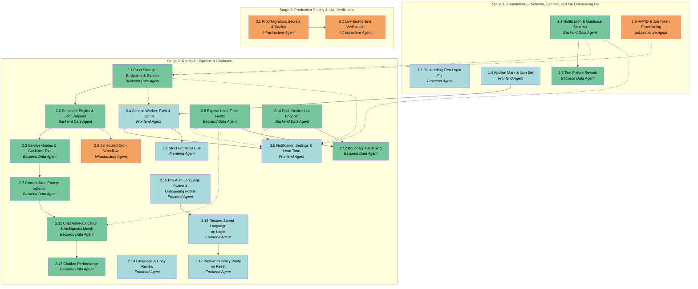

# APM Plan

## Workers

| Worker | Domain | Description |
|---|---|---|
| Backend Data Agent | Backend & Data | SQL migrations and RLS policies, FastAPI routers/services/db layers, push send pipeline, the reminder engine, the scheduled-job endpoint, and LLM tool-registry work. Owns the trust boundary. |
| Frontend Agent | Frontend | React feature modules, the service worker and PWA manifest, TanStack Query wiring, permission UX, Settings and form surfaces, and i18n parity across `en`/`el`. |
| Infrastructure Agent | Infrastructure & Deployment | Secret generation and Azure Key Vault provisioning, GitHub Actions workflows including the scheduled trigger, production migrations, deployment, and live production verification with the User. |

## Stages

| Stage | Name | Tasks | Agents |
|---|---|---|---|
| 1 | Foundation — Schema, Secrets, and the Onboarding Fix | 5 | Backend Data Agent, Frontend Agent, Infrastructure Agent |
| 2 | Reminder Pipeline & Guidance | 16 | Backend Data Agent, Frontend Agent, Infrastructure Agent |
| 3 | Production Deploy & Live Verification | 2 | Infrastructure Agent |
| 4 | Beta Readiness | 8 | Infrastructure Agent, Frontend Agent, Backend Data Agent |

## Dependency Graph

---

> **Notes:**
> - **Stage 1 is the session's best parallelism** — all three Workers have fully independent work with no
>   cross-dependencies inside the Stage. Task 1.2 (onboarding fix) is deliberately placed here despite
>   belonging to no other thread; it touches nothing else this session and would otherwise leave the
>   Frontend Agent idle while the schema lands. Tasks 1.2 and 1.4 are independent of each other and form a
>   natural Frontend batch.
> - **Task 1.4 exists because Task 2.4 needs an icon set that nothing else produces.** It is placed in
>   Stage 1 so the assets are ready before the manifest needs them, and because it carries a User design
>   decision that is better made early than under deadline pressure at the end of the build.
> - **Task 2.2 is the critical path and the highest-risk Task.** It concentrates ledger idempotency, the
>   first service-role/RLS-bypassing code path, constant-time token auth, lead-time resolution, and
>   server-side bilingual copy. Everything in Stage 3 ultimately validates it. Worth close review.
> - **Task 2.1 is the convergence point** — three downstream Tasks across two other domains wait on its
>   endpoint contract. Dispatching it early in Stage 2 unblocks the widest set of parallel work.
> - Backend's Stage 2 Tasks (2.1 → 2.2 → 2.3) form a natural sequential batch; Frontend's (2.4 → 2.5)
>   likewise. Task 2.3 is functionally independent of 2.1/2.2 and depends on them only through the
>   same-Worker chain — it could be reordered within the batch if useful.
> - **Several validation criteria are unreachable from the development environment.** Web Push requires
>   HTTPS and a real browser subscription, so Tasks 1.2, 2.4, 2.5, and all of Stage 3 carry User-executed
>   verification. Stage 3 exists because the session's definition of done is structurally
>   production-only.
> - **A holistic checkpoint at the Stage 2 boundary is worth considering** before deploying: the backend
>   can send a real push via the test endpoint, and the frontend can register a subscription, but nothing
>   has yet exercised cron → job → due-query → delivery as one path. Stage 3 is the first time that runs
>   whole.
> - Session 3's record shows repeatedly that live-model and live-device testing caught defects stubbed
>   tests could not. Tasks 2.3 and 3.2 are written with that expectation built in.
> - The User verifies personally and directly, and has historically caught real defects during hands-on
>   review. Expect verification checkpoints to surface genuine work rather than rubber-stamp.

## Stage 1: Foundation — Schema, Secrets, and the Onboarding Fix

### Task 1.1: Notification & Guidance Schema - Backend Data Agent

* **Objective:** Create and verify the database objects the reminder and guidance features require, with row-level security proven by cross-user denial tests.
* **Output:** One new versioned migration under `supabase/migrations/` creating `push_subscriptions`, `notification_deliveries`, and `service_guides`, plus the `subscriptions.reminder_lead_days` column; RLS policies on all three tables; new tests in `backend/tests/` covering cross-user denial for the two user-scoped tables and read-only access semantics for `service_guides`.
* **Validation:** Migration applies cleanly to the **dev** Supabase project with no history drift. A second authenticated user provably cannot SELECT, UPDATE, or DELETE the first user's `push_subscriptions` or `notification_deliveries` rows — asserted by tests following the existing pattern, not by inspection. An authenticated user can read `service_guides` but cannot write to it. The uniqueness constraint on `notification_deliveries` rejects a duplicate `(user_id, subscription_id, kind, due_date)` insert — assert this directly. `subscriptions.reminder_lead_days` accepts NULL and existing rows are unaffected. Backend test suite passes (see the note on shared-dev flakiness — confirm any failure by isolated rerun).
* **Guidance:** Table shapes are specified in the Spec's "Data Model Additions" section and `docs/APP_DESCRIPTION.md` §5.1. Follow the RLS pattern established in the three existing migrations (`auth.uid() = user_id`, one policy per operation). `service_guides` is global reference data — model its access on the authenticated-read pattern rather than user scoping, as `fx_rates` does. The cross-user test pattern lives in `backend/tests/test_rls.py` and `backend/tests/test_chat_rls.py`; `conftest.py` provides `user_a`/`user_b` fixtures that mint real Supabase users. Keep `kind` on the ledger a constrained value so future notification types need no schema change. The Supabase CLI is currently linked to **prod** — relink to dev and confirm `supabase login` before pushing; this has cost time in every prior session. Do not apply anything to prod in this Task.
* **Dependencies:** None

1. Relink the Supabase CLI to the dev project and confirm authentication before any migration work.
2. Write the migration creating the three tables, their indexes, and the `subscriptions.reminder_lead_days` column.
3. Add RLS policies: full per-user CRUD on the two user-scoped tables, authenticated-read-only on `service_guides`.
4. Apply the migration to dev and confirm no history drift.
5. Write cross-user RLS denial tests for both user-scoped tables, following the existing test pattern.
6. Write a test asserting the ledger's uniqueness constraint rejects a duplicate insert.
7. Run the backend test suite and confirm results, rerunning any failure in isolation to rule out known shared-dev flakiness.

### Task 1.2: Onboarding First-Login Fix - Frontend Agent

* **Objective:** Ensure a new user reaches the onboarding wizard directly, exactly once, without the dashboard rendering and fetching first.
* **Output:** Modified onboarding routing — the gate moved ahead of dashboard render — plus corrections to profile cache handling and the completion path; updated or added tests in `frontend/src/` covering the redirect, the post-completion path, and the profile-fetch-failure case.
* **Validation:** A brand-new account (verified by the User, ideally via the Google OAuth path) lands in the wizard without the dashboard visibly rendering or loading data first. Completing the wizard returns the user to the dashboard and the wizard does **not** reappear. A user who exits mid-flow is not force-redirected on their next visit and can resume via the Overview banner — this existing behaviour must not regress. When the profile fetch fails, an error state is surfaced rather than the user being silently left un-onboarded. `npm run test` passes and `npm run build` succeeds locally.
* **Guidance:** The Spec's "Onboarding Defect Correction" section describes all three failure modes and the required outcome. The root cause is documented there: the current gate is a post-fetch `useEffect` in `frontend/src/features/dashboard/DashboardShell.tsx` (lines 22-26) while `<Outlet/>` renders unconditionally, and completion in `frontend/src/features/onboarding/useOnboarding.ts` clears the `entered` flag while `useUpdateProfile` in `frontend/src/hooks/useMe.ts` only invalidates `['me']` without writing the profile the PATCH already returned. **Cache-level patches alone are insufficient** — they resolve the double-wizard symptom while leaving the dashboard-renders-first symptom intact. Relevant files also include `frontend/src/features/auth/ProtectedRoute.tsx`, `frontend/src/routes/auth/Login.tsx` (OAuth `redirectTo`), `frontend/src/App.tsx`, and `frontend/src/features/onboarding/onboarding-state.ts`. Note that jsdom in this project has no `localStorage` — the polyfill is in `frontend/src/test/setup.ts`. Any new user-facing copy needs `en` and `el` keys.
* **Dependencies:** None

1. Spawn a subagent to confirm the current routing and cache behaviour against the described root causes before changing anything, so the fix targets verified mechanics.
2. Move the onboarding decision ahead of dashboard render so the dashboard and its queries do not mount for a user who should be onboarding.
3. Handle the profile-fetch-failure case explicitly with a surfaced error state.
4. Correct the completion path so returning to the dashboard cannot re-trigger the wizard.
5. Preserve resumability: a user who leaves mid-flow is not force-redirected again.
6. Add or update tests covering first-login redirect, post-completion, resumption, and fetch failure.
7. Run `npm run test` and `npm run build`, then pause for the User to verify with a genuinely new account.

### Task 1.3: VAPID & Job Token Provisioning - Infrastructure Agent

* **Objective:** Generate and provision the secrets the push and scheduled-job features depend on, across local development and Azure Key Vault.
* **Output:** A VAPID keypair and a job token; secrets stored in Azure Key Vault and referenced by the Container App; corresponding GitHub Actions secrets; updated `backend/.env.example` and `frontend/.env.example` templates; updated backend configuration accepting the new environment variables; documentation of what was provisioned and where.
* **Validation:** The backend reads the VAPID keypair, VAPID subject, and job token from environment configuration with no hardcoded values. `.env.example` templates list every new variable with placeholder values and no real secrets. Key Vault contains the secrets and the Container App references them. The frontend build receives the VAPID **public** key only. Confirm with the User that no secret appears in any committed file — `git diff` reviewed before commit.
* **Guidance:** This Task is almost entirely User-executed: prepare exact, ordered, explained commands and pause for the User to run them and report results, per the external-platform standard. Do not assume credentials or act on the User's behalf. The VAPID private key is a secret and belongs only in Key Vault and the local gitignored `.env`; the public key is deliberately public and is baked into the frontend build. The job token is a shared secret between GitHub Actions and the backend — it needs to exist in both Key Vault (for the Container App) and GitHub Actions secrets (for the workflow). Follow the secret-provisioning pattern established in Sessions 1 and 3. Teach the VAPID concept before generating keys — what the keypair proves and why push services require it — as this is a first-time concept in the project.
* **Dependencies:** None

1. Explain the VAPID mechanism and what each key does before generating anything.
2. Prepare and present the exact command to generate a VAPID keypair; pause for the User to run it.
3. Prepare and present the command to generate a high-entropy job token; pause for the User to run it.
4. Prepare the Key Vault commands to store the private key, subject, and job token; pause for the User to execute.
5. Prepare the GitHub Actions secret commands or UI steps for the job token; pause for the User.
6. Extend backend configuration to read the new variables from the environment.
7. Update both `.env.example` templates and confirm with the User that no real secret is staged for commit.

### Task 1.4: Apollon Mark & Icon Set - Frontend Agent

* **Objective:** Give the assistant a visual identity and produce the icon set the installable app and its notifications require.
* **Output:** An Apollon mark selected by the User from several distinct options; an application icon set at the sizes required for installation on desktop and iOS; a notification icon; the assets committed in appropriate formats under `frontend/public/` or the equivalent existing asset location, with the mark applied wherever the assistant is currently represented in the chat interface.
* **Validation:** The User selects the mark from genuine alternatives rather than approving a single proposal. The mark is legible at small sizes — verify at the smallest size actually used, not only at full size, since an icon that works in a header can turn to mush as a favicon or notification badge. The icon set covers every size required for installation, including the iOS Home Screen sizes, with no missing or upscaled entries. The mark renders correctly against both dark and light backgrounds, dark mode being the primary target. Assets are reasonably sized — an oversized icon set is shipped to every visitor on first load. The chat interface displays the mark without layout regression. `npm run test` passes and `npm run build` succeeds locally.
* **Guidance:** This Task exists partly because Task 2.4 needs an icon set for the web app manifest and notifications, and nothing else in this session produces one — so treat the app icon, the notification icon, and the assistant's mark as one coherent visual identity rather than three unrelated assets. Visual and aesthetic choices are decided interactively with the User: present two or three genuinely different directions and let them choose, rather than settling it unilaterally. The assistant is named Apollon (Απόλλων) and its established tone is neutral, professional, clear, and concise — the mark should match that rather than undercut it. Avoid the generic AI-product tells the project's standards call out: sparkle motifs, purple gradients, and decorative flourishes that carry no information. A simple geometric or letterform mark will age better and survive scaling to a 32-pixel notification badge. Prefer SVG for in-app use and generate raster sizes for the manifest, since installation targets require specific pixel dimensions. Check where the assistant is currently represented in `frontend/src/features/chat/` before adding a new surface for it. The mark is decorative rather than informational, so it needs no i18n keys, but any accompanying text does.
* **Dependencies:** None

1. Review how the assistant is currently represented in the chat interface to establish where a mark would apply.
2. Produce two or three genuinely distinct mark directions and present them to the User for selection.
3. Refine the chosen direction, checking legibility at the smallest size it will actually be used.
4. Generate the full icon set at the sizes required for desktop and iOS installation, plus the notification icon.
5. Verify the mark renders correctly on both dark and light backgrounds.
6. Apply the mark in the chat interface and confirm no layout regression.
7. Run `npm run test` and `npm run build`, then confirm the result with the User.

### Task 1.5: Test Fixture Rework - Backend Data Agent

* **Objective:** Stop the backend suite's live-DB flakiness from growing with every new table, so that a failing test means a real defect rather than a rate limit.
* **Output:** Reworked user fixtures in `backend/tests/conftest.py` that stop minting a fresh Supabase user per test function, with whatever per-test cleanup is required to preserve isolation; any test-file adjustments the new fixture shape requires; a short note in `docs/DECISIONS.md` recording the approach and why.
* **Validation:** The full backend suite runs green repeatedly — run it at least three times consecutively and report the failure count for each run, since a single green run proves nothing about a rate-limit problem. The count of real Supabase users created per full run is substantially reduced, and the reduction is stated as a number rather than asserted. **Test isolation is preserved and demonstrated**: tests that share a user must not see each other's rows, and the existing cross-user RLS denial tests must still genuinely prove denial rather than passing because the data they expected was never there. No test is deleted, weakened, or converted to a mock to make it pass. Ruff and black clean.
* **Guidance:** The problem is measured, not suspected: `user_a` and `user_b` are function-scoped, so each of roughly 64 test functions across 11 files creates and deletes a real Supabase user through the Auth Admin API — up to ~128 back-to-back round-trips per run. Supabase rate-limits this, producing `AuthError: Invalid authentication credentials` at random points in the suite. Task 1.1's run produced 8 failures against a previously documented 1–3, and every future user-scoped table adds more under the project's mandatory RLS-testing rule. **That rule is correct and must not be weakened — the fix belongs in the fixtures, never in the tests' assertions.** The likely shape is a session-scoped pool of a small number of users handed out to tests, with row-level cleanup between tests so isolation survives sharing; but assess the options and choose deliberately, because a shared user with sloppy cleanup trades a visible flake for an invisible false pass, which is strictly worse. Pay particular attention to the cross-user denial tests in `test_rls.py`, `test_chat_rls.py`, and `test_notification_rls.py`: a denial test that passes because the row was absent proves nothing, so verify each still fails when RLS is hypothetically removed rather than trusting a green result. Note that the suite runs against shared dev Supabase, so concurrent runs from elsewhere are possible. Explain the isolation-versus-reuse tradeoff to the User before implementing it.
* **Dependencies:** `Task 1.1`

1. Measure the current baseline: how many users a full run creates, and the failure count across a few consecutive runs.
2. Explain the isolation-versus-reuse tradeoff and the chosen approach to the User before changing fixtures.
3. Rework the user fixtures to stop per-test user creation, adding whatever cleanup preserves isolation.
4. Adjust any tests the new fixture shape requires, without weakening a single assertion.
5. Verify the cross-user denial tests still genuinely prove denial rather than passing on absent data.
6. Run the full suite at least three consecutive times and report the failure count for each.
7. Record the approach and its rationale in `docs/DECISIONS.md`.

## Stage 2: Reminder Pipeline & Guidance

### Task 2.1: Push Storage, Endpoints & Sender - Backend Data Agent

* **Objective:** Enable the backend to store per-device push subscriptions and deliver an encrypted notification to them.
* **Output:** Data-access functions for `push_subscriptions`; a push router exposing subscribe, unsubscribe, and a development-only test-send endpoint; a push delivery service wrapping `pywebpush`, including dead-subscription pruning; Pydantic request/response models; tests covering the endpoints and the pruning behaviour.
* **Validation:** A subscribe request persists a subscription scoped to the authenticated user; repeating it for the same endpoint does not create a duplicate row. Unsubscribe removes the row. The test-send endpoint delivers a real notification to a registered browser — this requires the User and a real browser, and is the first genuine proof the pipeline works. A simulated `410 Gone` from the push service results in the subscription row being deleted rather than retried; a different failure leaves the row in place. The test endpoint is unavailable outside development. No push endpoint, key, or notification body appears in any log output. Backend tests pass.
* **Guidance:** The delivery model — per-device subscriptions, best-effort delivery, prune-on-`410` — is specified in the Spec's "Notification Delivery Model" section; the API surface follows `docs/APP_DESCRIPTION.md` §6.7. This service is the **delivery adapter** and must not contain any reminder logic: it knows how to send a message to a subscription, not when or why. Keep it structured so a second adapter (email, Session 7) can sit alongside it without touching callers. Follow the strict `routers/` → `services/` → `db/` layering and the RLS-scoped connection pattern in `backend/app/db/rls.py`. `pywebpush` is a new dependency — pin it. Teach the Web Push encryption model before implementing: why a subscription carries two keys, and what the push service can and cannot see.
* **Dependencies:** `Task 1.1`, **`Task 1.3 by Infrastructure Agent`** (VAPID keypair and configuration must exist before the sender can be configured)

1. Explain the Web Push encryption and subscription model before writing code.
2. Add `pywebpush` as a pinned dependency.
3. Implement data-access functions for storing, listing, and removing push subscriptions under RLS.
4. Implement the delivery service: send to a subscription, classify failures, prune on permanent rejection.
5. Implement the subscribe and unsubscribe endpoints with Pydantic validation.
6. Implement the development-only test-send endpoint, guarded so it cannot be reached in production.
7. Write tests for endpoint behaviour, duplicate-subscribe handling, and prune-versus-retain failure classification.
8. Pause for the User to register a real browser subscription and confirm a test notification arrives.

### Task 2.2: Reminder Engine & Job Endpoint - Backend Data Agent

* **Objective:** Build the channel-agnostic renewal reminder engine and expose it through an externally-triggered, token-authenticated job endpoint.
* **Output:** A reminder engine service performing due detection, lead-time resolution, suppression, ledger writes, and bilingual message rendering; a dedicated module holding the notification copy strings in `en` and `el`; service-role data-access functions scoped to the job; a job router exposing the run-due endpoint with constant-time token authentication; tests covering due detection, lead-time precedence, suppression, idempotency, and authentication.
* **Validation:** A subscription renewing within its effective lead time is detected as due; one outside it is not; one whose renewal already passed is not. A per-subscription lead-time override takes precedence over the profile default, and a NULL override falls back to it — assert both directions explicitly. Cancelled and paused subscriptions produce no reminder. **Running the job twice in succession produces exactly one notification per due subscription** — the ledger's uniqueness constraint is the mechanism, and this must be proven by test, not assumed. The endpoint rejects a missing token, a wrong token, and a malformed token identically, with no information leaked through error shape. Copy renders correctly in both `en` and `el`, with `auto` resolving to English. The job bounds its work rather than processing an unbounded result set. No notification content appears in logs. Backend tests pass.
* **Guidance:** The architecture is specified in the Spec's "Scheduled Work Architecture" and "Reminder Semantics" sections — read both before starting; they define the ledger key, the lead-time formula, suppression timing, and the per-subscription (not digest) rule. **This Task introduces the project's first RLS-bypassing code path.** The job has no user and must read across all users, so it needs a service-role connection — confine that access to this Task's own data-access functions, never widen shared helpers, and never make it reachable from a user-authenticated route. The narrow-use precedents are `backend/app/db/fx.py` and `backend/app/db/usage.py`. Use the existing constant-time comparison helper at `backend/app/security/compare.py` for the token check — it was written earlier and is currently uncalled; this is its first real use. The engine must not import or call the push adapter directly in a way that couples them — delivery is a collaborator, so a second channel can be added in Session 7 without touching this logic. Notification copy is the project's first server-side localized text; keep it in a dedicated module, not inline. Teach the service-role/RLS boundary explicitly before writing it — it is the most security-significant change in the session.
* **Dependencies:** `Task 2.1`

1. Explain the service-role boundary and why a user-less job cannot use the RLS-scoped connection pattern, before implementing it.
2. Implement service-role data-access functions returning subscriptions due for a reminder, scoped narrowly to this job.
3. Implement lead-time resolution with the per-subscription override falling back to the profile default.
4. Implement suppression so only active subscriptions are considered, evaluated at send time.
5. Implement ledger writes such that a conflicting insert marks the reminder already handled and skips it.
6. Create the bilingual notification copy module and render messages from the user's preferred language.
7. Implement the job endpoint with constant-time token authentication, uniform failure responses, and a bound on work per invocation.
8. Wire the engine to the push adapter as a collaborator, keeping delivery swappable.
9. Write tests for due detection, lead-time precedence in both directions, suppression, double-run idempotency, and authentication failure modes.
10. Run the job twice by hand against dev data and confirm no duplicate notification is produced.

### Task 2.3: Service Guides & Guidance Tool - Backend Data Agent

* **Objective:** Give the assistant verified cancellation guidance for well-known services, with a clearly-marked fallback for everything else, and correct the prompt rule that leaves chat-created subscriptions uncategorised.
* **Output:** Seed data for `service_guides` covering roughly 15–20 well-known services; a `get_subscription_guide` tool registered in the existing tool registry with a Pydantic args model and handler; a tool result carrying explicit provenance distinguishing curated from model-generated content; an adjustment to the Apollon identity prompt covering both cancellation guidance and category classification; tests covering the tool's registration, validation, lookup behaviour, provenance, and category assignment on chat-created subscriptions.
* **Validation:** Asking the assistant how to cancel a curated service returns the curated steps and URL, with provenance marked as verified. Asking about an uncurated service returns guidance marked as unverified, and the response contains no clickable model-generated link. The tool rejects a malformed payload with a clean error returned to the model rather than a partial execution. The existing negative assertions in `backend/tests/test_tools.py` (which currently assert this tool is absent) are updated. **A live model call confirms the tool fires correctly against the configured provider** — stubbed tests are not sufficient here. The prompt still refuses generalised financial and investment advice while permitting concrete cancellation guidance; verify both behaviours live, in English and Greek. Adding a subscription for a recognisable service through the chat assigns a sensible category rather than leaving it NULL — verified by a live conversation, not only by test — while the model still refuses to invent a price or a date it was not given. Backend tests pass.
* **Guidance:** The design, including the two-tier trust model, is in the Spec's "Subscription Guidance" section — the curated-versus-model-generated distinction is the security core and must be reflected in the tool's output shape so the frontend can render accordingly. Register via `ToolSpec` and `register()` in `backend/app/services/tools.py`; **do not modify the chat loop** — adding a tool is a registration, per the standing rule. New args models must survive the provider-specific schema sanitizers in that file (`_gemini_safe_schema` inlines refs and collapses nullable unions); Session 3 established that only live calls catch these problems. The backend must never fetch a cancel URL from either source. The prompt lives in `backend/app/services/prompts.py`; the current identity block declines generalised financial advice — narrow that rather than removing it, preserving the grounding, no-tool-name-leakage, and destructive-confirmation rules unchanged. Seed content should favour accuracy over breadth: a shorter verified list beats a longer stale one, and the schema supports expansion later. Collaborate with the User on which services to include, as they are the primary user. A defect observed in live use is corrected here because it lives in the same prompt: subscriptions added through the chat arrive with no category. The plumbing is already correct — `category` is on `SubscriptionCreate`, exposed in the `add_subscription` schema, and passed through by the handler — so the cause is the identity prompt's rule forbidding the model to invent "a made-up price, category, or date". Encode the distinction between fabrication and classification: never invent a price or a date, but do assign one of the five `Category` enum values to a recognisable service, preferring `service_guides.category` where a curated row exists and leaving NULL only when the service is genuinely unrecognisable.
* **Dependencies:** `Task 1.1`, `Task 2.2`

1. Agree the seed service list with the User, weighting toward services they actually use plus obvious well-known names.
2. Write the seed data with cancellation steps, plan information, and cancel URLs.
3. Implement the guidance lookup: curated row first, model fallback when absent, provenance carried in the result.
4. Register the tool with a Pydantic args model and handler, leaving the chat loop untouched.
5. Adjust the Apollon identity prompt to permit data-grounded cancellation guidance while preserving the existing refusals and safety rules.
6. In the same prompt, separate classification from fabrication so recognisable services get a category on creation while prices and dates are still never invented.
7. Update the existing tests that assert the tool is not registered.
8. Write tests for lookup behaviour, provenance, and payload validation failure.
9. Run a live model conversation covering a curated service, an uncurated service, an off-topic financial question, and adding a well-known subscription to confirm it lands categorised — in both English and Greek; confirm behaviour with the User.

### Task 2.4: Service Worker, PWA & Opt-In - Frontend Agent

* **Objective:** Let a user grant notification permission and receive push notifications, on desktop browsers and on iOS.
* **Output:** A service worker handling push events and notification activation; a web app manifest wired to the icon set from Task 1.4, enabling iOS installation; an iOS-specific install instruction surface; a permission request flow that registers the subscription with the backend; the onboarding notification step converted from a placeholder into a working step gated on the user having at least one subscription; `en` and `el` keys for all new copy.
* **Validation:** Granting permission registers a push subscription with the backend and a test notification is received and displayed. Activating a notification opens the dashboard, focusing an existing app window when one is open rather than opening a duplicate. The manifest passes browser installability checks, and the app can be added to the iOS Home Screen and receive a notification there — User-verified on a real iPhone. The onboarding notification step appears only when at least one subscription exists, and declining is respected without blocking flow completion. Denying the browser permission produces a clear, non-broken state. `en` and `el` are at exact key parity. `npm run test` passes and `npm run build` succeeds locally.
* **Guidance:** The delivery model and the iOS constraint are specified in the Spec's "Notification Delivery Model" section; opt-in timing is specified in "Reminder Semantics" and the Session Scope. **The service worker is a new execution context**, not a React component — it runs without a page open, has its own lifecycle, and cannot access React state. Teach this before implementing it; it is a first-time concept in the project. The project ships a strict Content-Security-Policy — verify service worker registration and the manifest are compatible with it rather than discovering a conflict in production. iOS grants Web Push only to Home Screen installations and offers no install prompt, so the instruction surface must tell the user to use Share → Add to Home Screen, shown only where relevant. Backend subscribe/unsubscribe endpoints come from Task 2.1 — follow the existing TanStack Query hook conventions in `frontend/src/hooks/useMe.ts` and route calls through `frontend/src/lib/api.ts`. The onboarding step currently renders a "coming soon" stub in `frontend/src/features/onboarding/`; replace it rather than adding a parallel component. Present visual and copy choices to the User for selection rather than settling them unilaterally; keep the styling restrained and avoid decorative chrome.
* **Dependencies:** `Task 1.4`, **`Task 2.1 by Backend Data Agent`** (subscribe/unsubscribe endpoint contract and the VAPID public key must exist)

1. Explain the service worker execution model and the Web Push browser flow before implementing.
2. Implement the service worker: receive push events, display notifications, handle activation by focusing or opening the dashboard.
3. Add the web app manifest referencing the icon set produced earlier, and verify compatibility with the existing Content-Security-Policy.
4. Implement the permission request flow, registering the resulting subscription with the backend.
5. Add the iOS install instruction surface, shown only to iOS visitors, presenting options to the User for selection.
6. Replace the onboarding notification placeholder with the working step, gated on at least one subscription existing.
7. Add `en` and `el` keys for all new copy and confirm exact parity.
8. Run `npm run test` and `npm run build`, then pause for the User to verify on both a desktop browser and a real iPhone.

### Task 2.5: Notification Settings & Lead Time - Frontend Agent

* **Objective:** Let users manage reminder preferences, registered devices, and per-subscription lead times.
* **Output:** A working notification section in Settings — enabling and disabling reminders, setting the per-user lead time, listing registered devices, and revoking them; a per-subscription lead-time field on the subscription form; `en` and `el` keys for all new copy; tests covering the new surfaces.
* **Validation:** Changing the per-user lead time persists and survives a reload. Revoking a device removes the stored subscription server-side, not merely locally — verify the row is gone rather than trusting the UI. Setting a per-subscription lead time persists, and clearing it returns the subscription to inheriting the user default, with the inherited value made visible to the user rather than left blank and ambiguous. The monthly review control **remains visibly disabled** — its feature does not exist until a later session and it must not appear functional. Form validation rejects nonsensical lead times. `en` and `el` are at exact key parity. `npm run test` passes and `npm run build` succeeds locally.
* **Guidance:** Lead-time semantics — the per-subscription override with NULL meaning inherit — are specified in the Spec's "Reminder Semantics" section, and the constraint on the monthly review control is in "Data Model Additions". The Settings notification switches already exist but are rendered permanently disabled in `frontend/src/features/settings/SettingsPanel.tsx`; this Task makes the reminder-related ones real while leaving the monthly review one disabled. The subscription form is `react-hook-form` + `zod` — Zod here is UX validation only, as the backend re-validates. Use the established TanStack Query mutation pattern with cache invalidation on success, following `frontend/src/hooks/useSubscriptions.ts` and `useMe.ts`. Note that the profile update path was implicated in the Task 1.2 defect — if that Task changed profile cache handling, stay consistent with it rather than reintroducing the old pattern. Present the lead-time control's visual treatment to the User for selection; a number input, a slider, and a preset-with-custom option all read very differently.
* **Dependencies:** `Task 2.4`, **`Task 2.8 by Backend Data Agent`** (the profile and subscription APIs must expose `renewal_lead_days` and `reminder_lead_days` before this Task can persist them), **`Task 2.10 by Backend Data Agent`** (the device-list endpoint for the registered-devices list), **`Task 2.1 by Backend Data Agent`** (unsubscribe endpoint for device revocation)

1. Present lead-time control options to the User and implement the chosen treatment.
2. Wire the reminder enable/disable and per-user lead-time controls in Settings, leaving the monthly review control disabled.
3. Implement the registered-device list with working revocation through the backend.
4. Add the per-subscription lead-time field to the subscription form, showing the inherited default when unset.
5. Add `en` and `el` keys for all new copy and confirm exact parity.
6. Add tests covering preference persistence, revocation, and inherit-versus-override behaviour.
7. Run `npm run test` and `npm run build`, then pause for User review of the surfaces.

### Task 2.6: Scheduled Cron Workflow - Infrastructure Agent

* **Objective:** Trigger the reminder job on a daily schedule from GitHub Actions.
* **Output:** A scheduled GitHub Actions workflow invoking the job endpoint with the job token; documentation of the schedule, its timing rationale, and how to trigger a run manually.
* **Validation:** The workflow authenticates successfully against the deployed backend and the job executes. A manual trigger is possible without waiting for the schedule — confirm this works, as it is the primary operational tool for verification and debugging. A failed run surfaces visibly rather than failing silently. The job token is referenced from GitHub Actions secrets and appears nowhere in the workflow file or logs. The workflow does not run on pull requests or pushes, only on its schedule and manual dispatch.
* **Guidance:** The trigger architecture is specified in the Spec's "Scheduled Work Architecture" section. The endpoint path and authentication header come from Task 2.2. GitHub Actions cron uses UTC — the fixed hour was chosen relative to Athens time, so convert deliberately and document the conversion rather than leaving a bare cron expression whose intent is unrecoverable. Include a manual dispatch trigger; it is needed for Stage 3's verification and for any future debugging. Note that GitHub's scheduled workflows can be delayed under load and are not precise — this is acceptable for a daily reminder and worth documenting so the imprecision is not later mistaken for a bug. Follow the existing workflow conventions in `.github/workflows/`. The Container App is scale-to-zero, so the first request may be slow — allow for a cold start rather than setting an aggressive timeout.
* **Dependencies:** **`Task 2.2 by Backend Data Agent`** (job endpoint path and authentication contract)

1. Write the scheduled workflow with both cron and manual dispatch triggers.
2. Convert the intended local time to UTC and document the conversion and its rationale in the workflow.
3. Reference the job token from GitHub Actions secrets, ensuring it cannot appear in logs.
4. Allow for Container App cold start in the request timeout.
5. Ensure failures surface visibly rather than passing silently.
6. Verify a manual dispatch reaches the deployed backend and the job executes.

### Task 2.7: Current-Date Injection in the Chat Prompt - Backend Data Agent

* **Objective:** Give the chat model the real current date so relative dates ("today", "yesterday", "last month") on chat-created subscriptions resolve correctly instead of to the model's training-cutoff date.
* **Output:** The system prompt carrying the actual current date at request time; a test locking in that the date is present and correct in the assembled prompt; live confirmation that a relative date on a chat-added subscription is stored correctly.
* **Validation:** Adding a subscription via chat with a relative date ("started today", "since last month") stores a `start_date` matching the real current date, verified live in both English and Greek — not the training-cutoff date. `next_renewal_date` derived from it is consequently correct. The date is computed per request (not a module-level constant frozen at import), so a long-running process stays correct across day boundaries. The model still refuses to invent a date it was genuinely not given — supplying the current date must not become licence to fabricate a start date the user never stated; "add Netflix" with no date still asks. Existing chat and prompt tests pass; the model still resolves an absolute date the user gives ("started on 3 March") correctly.
* **Guidance:** This corrects a live defect found during Task 2.3: "add Netflix, started today" stored `start_date` as the model's training-cutoff date (2025-05-18) because the prompt never supplies the current date. The fix belongs at the per-request assembly point `build_system_prompt(preferred_language, *, onboarding)` in `backend/app/services/prompts.py` (used by `backend/app/services/chat.py`), alongside the existing language directive — not baked into the module-level `_APOLLON_IDENTITY` / `APOLLON_SYSTEM_PROMPT` constants, which are evaluated once at import and would freeze the date. Inject a short, unambiguous directive stating today's date (ISO `YYYY-MM-DD`) and instructing the model to resolve relative dates against it while continuing to never invent a date the user did not provide. Keep the change minimal and surgical — this is a one-line-of-context prompt addition plus a test, not a redesign. The dev backend is running on `localhost:8000` and the REPL at `backend/scripts/chat_repl.py` drives the real engine for live verification. Confirm the fix and the still-refuses-to-fabricate behaviour with the User.
* **Dependencies:** `Task 2.3`

1. Add a per-request current-date directive to `build_system_prompt`, computed at call time, in ISO format.
2. Instruct the model to resolve relative dates against it while preserving the rule that it never invents a date the user did not give.
3. Add a test asserting the assembled prompt contains the correct current date and that the date is not frozen at import.
4. Confirm existing chat/prompt tests still pass.
5. Live-verify in EN and EL: a relative date stores correctly; an absent date still prompts the user; an absolute date the user gives still works.

### Task 2.8: Expose Lead-Time Fields Through the API - Backend Data Agent

* **Objective:** Expose the per-user and per-subscription lead-time fields through the profile and subscription APIs so the Settings and subscription-form surfaces can read and persist them.
* **Output:** `profiles.renewal_lead_days` readable via `GET /me` and writable via `PATCH /me`; `subscriptions.reminder_lead_days` accepted on create/update and returned on read; Pydantic validation matching the DB CHECK constraints; tests covering persistence, inherit-vs-override, and range rejection.
* **Validation:** `PATCH /me` with a `renewal_lead_days` value persists and is returned by `GET /me`. Creating or updating a subscription with `reminder_lead_days` persists and is returned; omitting it (or sending null) stores NULL, meaning inherit. The backend rejects an out-of-range lead time (Pydantic validation, matching the DB `CHECK (>= 0 AND <= 30)` for `reminder_lead_days` and a sane bound for `renewal_lead_days`) — the backend is the trust boundary; the frontend's Zod is UX only. `monthly_review_enabled` is exposed **read-only** on the profile response so its disabled Settings switch can reflect the stored default, but it is **not** added to the profile's updatable columns (its feature is a later session and the control stays disabled). RLS is unchanged. Backend tests pass.
* **Guidance:** This Task exists because Task 1.1 added the `reminder_lead_days` column and `renewal_lead_days`/`monthly_review_enabled` already existed, but none are wired into the API — the Manager found the gap when sequencing Task 2.5, which cannot persist lead times without them. For the profile: add `renewal_lead_days` (and read-only `monthly_review_enabled`) to `ProfileResponse` in `backend/app/models/profile.py`, add `renewal_lead_days` to `ProfileUpdate`, extend the SELECT and the `_UPDATABLE_COLUMNS` allowlist in `backend/app/db/profiles.py` — add `renewal_lead_days` to the allowlist but **not** `monthly_review_enabled`. For subscriptions: add `reminder_lead_days` to `SubscriptionCreate`, `SubscriptionUpdate`, and `SubscriptionResponse` in `backend/app/models/subscription.py`, and to the shared `_COLUMNS` and `_UPDATABLE_COLUMNS` in `backend/app/db/subscriptions.py` (note the comment there that SELECT/RETURNING/INSERT lists are kept in one constant so they never drift). Keep the validation bounds consistent with the DB CHECK. This is additive and small; do not change RLS, the reminder engine, or unrelated fields.
* **Dependencies:** `Task 1.1`

1. Add `renewal_lead_days` (read+write) and read-only `monthly_review_enabled` to the profile models, SELECT, and updatable-columns allowlist (the latter for `renewal_lead_days` only).
2. Add `reminder_lead_days` to the subscription create/update/response models and the shared column constants.
3. Add Pydantic range validation matching the DB CHECK constraints.
4. Write tests: profile lead-time round-trip, subscription lead-time round-trip, NULL-means-inherit, and out-of-range rejection.
5. Run the backend suite.

### Task 2.9: Strict Frontend Content-Security-Policy - Frontend Agent

* **Objective:** Add a strict Content-Security-Policy to the served frontend, closing a standing gap against the project's security standards, without breaking the running app.
* **Output:** A strict CSP delivered via `frontend/public/staticwebapp.config.json` global response headers (and the built `dist` copy), scoped to exactly what the app legitimately loads; live confirmation that auth (including CAPTCHA), chat SSE streaming, push registration, and all API calls still work under it.
* **Validation:** The deployed-config CSP is strict — no blanket `default-src *`, no `unsafe-eval`, and `unsafe-inline` avoided or scoped as tightly as the toolchain allows. `worker-src 'self'` and `manifest-src 'self'` permit the Task 2.4 service worker and manifest; `connect-src` permits the backend API and Supabase (and any other origin the app genuinely calls); the auth CAPTCHA (Cloudflare Turnstile) and any font/style sources the app uses are permitted explicitly rather than by wildcard. **Verified live against the running app:** logging in (with the Turnstile CAPTCHA), streaming a chat reply over SSE, registering a push subscription, and normal dashboard/API traffic all work with the CSP active and **no violations in the browser console**. `npm run test` passes and `npm run build` succeeds.
* **Guidance:** The gap was confirmed in Task 2.4: `staticwebapp.config.json` defines only `navigationFallback` and there is no CSP header anywhere on the served frontend (the strict `default-src 'none'` is on the backend API's own responses only). Azure Static Web Apps applies response headers from the `globalHeaders` block of `staticwebapp.config.json` — that is the delivery mechanism (not a `<meta>` tag, which cannot express all directives). Build the policy from what the app actually loads: enumerate the real origins by loading the built app and reading the network panel and any CSP-violation console output, rather than guessing. Known consumers to account for: the backend API origin, Supabase (auth + REST), Cloudflare Turnstile (script and frame — the auth CAPTCHA, added in an earlier session), the service worker and manifest from Task 2.4, self-hosted assets and icons (which may use `data:` URIs), and Vite/Tailwind's styling (which may require a scoped `style-src` accommodation). A CSP that breaks login or chat is worse than the gap it closes, so the live verification is the real acceptance test — a passing build proves nothing about runtime CSP violations. Keep the dev and prod API/Supabase origins correct for each environment. This is delivered through the frontend's own served config; the Infrastructure Agent will confirm it survives the Stage 3 deploy.
* **Dependencies:** `Task 2.4`

1. Load the built app and enumerate every origin and resource type it legitimately loads (network panel + console).
2. Author a strict CSP in `staticwebapp.config.json` `globalHeaders`, allowing exactly those and no more, with `worker-src`/`manifest-src`/`connect-src` covering the push and API surfaces.
3. Verify live with the CSP active: login with CAPTCHA, chat SSE, push registration, dashboard/API traffic — zero console CSP violations.
4. Run `npm run test` and `npm run build`.
5. Pause for the User to confirm the app is fully functional under the CSP.

### Task 2.10: Push Device List Endpoint - Backend Data Agent

* **Objective:** Expose a GET endpoint returning the caller's registered push devices, so Settings can list and revoke them.
* **Output:** `GET /api/v1/push/subscribe` (or an equivalently-named route on the push router) returning the authenticated user's push subscriptions **without the encryption keys**; a list response model; tests covering the endpoint and cross-user isolation.
* **Validation:** The endpoint returns only the caller's own subscriptions, each carrying enough to identify a device (endpoint, `user_agent`, `created_at`) but **never `p256dh`/`auth`**. A second user cannot see the first user's devices (RLS-scoped, cross-user test with a positive control). Revocation continues to work through the existing `DELETE /push/subscribe/{endpoint}`. No endpoint or key appears in logs. Backend tests pass.
* **Guidance:** Task 2.1 already wrote the keyless data-access function `list_subscriptions_for_response` in `backend/app/db/push.py` and a thin `list_for_user` service function — this Task wires them to a route; check whether the route is genuinely absent first (Task 2.1 built the db/service layers but the push router has only subscribe/unsubscribe/test). Add the route to `backend/app/routers/push.py` under the existing `/push` prefix, authenticated by the same `get_current_claims`/`Claims` dependency as the sibling routes, going through `rls_connection` — this is a user-initiated surface, never service-role. Reuse or extend `PushSubscriptionResponse` (endpoint + user_agent) for the list items; add `created_at` if useful for display. The keys must never be in the response model — the existing `list_subscriptions_for_response` already omits them, so use it rather than the key-carrying `list_subscriptions` the sender uses. This is a small additive Task.
* **Dependencies:** `Task 2.1`

1. Confirm the push router has no list route and the keyless db/service functions from Task 2.1 exist.
2. Add the GET route returning the caller's devices without keys, RLS-scoped, via the existing service function.
3. Add or reuse a response model that excludes the encryption keys.
4. Write tests: the list returns only the caller's devices (cross-user denial with a positive control), and keys are absent from the response.
5. Run the backend suite.

### Task 2.11: Chat Anti-Fabrication for Lead Times & Ambiguous-Match Confirmation - Backend Data Agent

* **Objective:** Stop the chat agent from fabricating lead-time values the user did not give, and from silently applying an edit to a subscription it only fuzzily matched.
* **Output:** The `_APOLLON_IDENTITY` prompt's never-invent rule extended to the lead-time fields (`renewal_lead_days`, `reminder_lead_days`), kept distinct from the category-classification rule; a new ambiguous-subscription-match confirmation rule; prompt-level tests locking in both; live EN/EL confirmation.
* **Validation:** Asked to change a reminder lead time without a value, the model asks for it rather than fabricating one (live). Given a value, it sets it correctly (happy path unbroken). When the subscription reference is ambiguous or a fuzzy near-miss, the model confirms which subscription before editing (live); a clear reference still edits directly without a needless confirmation. The category, date, grounding, tool-name-hiding, financial-refusal, and destructive-confirmation rules are unchanged. Backend tests pass.
* **Guidance:** Two live defects found using the chat during Task 2.5: Apollon fabricated a lead-time value (5 days) the User never gave, and silently matched "Pokemon golf" to an existing "Pokemon go" and applied the edit without confirming. Both are prompt-level. The lead-time fields became chat-writable as a side effect of Task 2.8 (the tool registry reuses `ProfileUpdate`/`SubscriptionUpdate` directly). Extend the anti-fabrication sentence in `backend/app/services/prompts.py` to treat lead-time values like price/date (invent-forbidden), distinct from category (classification-allowed, Task 2.3). Add an ambiguous-match rule about *which* subscription an action targets — distinct from the destructive-confirmation discipline about *whether* to do a destructive thing — and applying to non-destructive edits too. Keep it surgical; iterate wording against the live model, since text-presence tests do not prove obedience.
* **Dependencies:** `Task 2.7`, `Task 2.8`

1. Extend the never-invent rule to cover lead-time values, kept distinct from category classification.
2. Add the ambiguous-subscription-match confirmation rule, distinct from the destructive-action discipline.
3. Add prompt-level tests for both additions; confirm existing prompt/chat tests pass.
4. Live-verify EN/EL: missing lead time asks; given lead time sets; ambiguous match confirms; clear match edits directly.

## Pre-Deploy Readiness (Stage 2 tail — before Stage 3 deploy)

Added at User request after Stage 2 feature work completed: bring the app to "fully usable" before it ships. Three Tasks plus a Manager-led full app check, all before the Stage 3 deploy. User picks Task order interactively.

### Task 2.12: Boundary Hardening — Profile Constraints & Fan-Out Cap - Backend Data Agent

* **Objective:** Close two standards gaps found during Stage 2: the profile lead-time columns lack a DB second wall, and the reminder fan-out's device query is unbounded.
* **Output:** A migration adding `NOT NULL` and a `CHECK (0..30)` to `profiles.renewal_lead_days` and `NOT NULL` to `profiles.monthly_review_enabled` (applied to **dev**; rides to prod in Task 3.1); a bound (LIMIT) on `db/push.py::list_subscriptions` used by the reminder fan-out; tests; no behaviour change.
* **Validation:** The migration applies cleanly to dev with no history drift and is safe against existing rows (dev has zero NULLs in these columns — confirm before applying). After it, an out-of-range or NULL `renewal_lead_days` is rejected at the database, not only by Pydantic (the two-walls standard). The reminder fan-out reads at most a bounded number of devices per user. Existing reminder/subscription/profile tests pass; the full suite is judged over three consecutive runs per the standing rule. No user-facing behaviour changes.
* **Guidance:** From the Task 2.8 finding: `profiles.renewal_lead_days` has no DB CHECK and both profile lead-time columns are nullable (`renewal_lead_days int default 3`, `monthly_review_enabled boolean default true`, both `is_nullable=YES`), so the 0–30 bound rests on Pydantic alone. Add the DB constraints via a migration under `supabase/migrations/`; confirm the CLI is on dev and there are zero NULLs first (a NOT NULL on a column with NULLs fails). From the Task 2.10 finding: `db/push.py::list_subscriptions` (the key-carrying one used by the reminder engine's fan-out on the job path) has no LIMIT; the sibling read path `list_subscriptions_for_response` was already capped at 100 in Task 2.10 — mirror that. Both are small, additive, and must not change behaviour. This migration is the second one reaching prod in Task 3.1 (with the notification schema and the service-guides seed).
* **Dependencies:** `Task 2.8`, `Task 2.10`

1. Confirm the CLI targets dev and the two profile columns hold zero NULLs.
2. Write and apply (dev) a migration adding NOT NULL + CHECK(0..30) to `renewal_lead_days` and NOT NULL to `monthly_review_enabled`.
3. Cap `list_subscriptions` with a LIMIT mirroring the 2.10 cap.
4. Add/adjust tests; confirm no behaviour change; run the suite three times.

### Task 2.13: Chatbot Performance — Diagnose & Fix What's Safe - Backend Data Agent

* **Objective:** Find where the chat latency actually comes from and apply the low-risk reductions, without regressing any chat behaviour.
* **Output:** A measurement of where per-turn time goes (system-prompt tokens, tool-schema payload, tool-loop iteration count, provider time-to-first-token, history replay); the safe latency reductions applied; anything larger reported for a User decision; a before/after latency comparison; live EN/EL confirmation that all chat behaviours still hold.
* **Validation:** The latency sources are measured and reported as numbers, not guessed. The applied changes measurably reduce per-turn latency (state before/after). **No chat behaviour regresses** — re-verify live in EN and EL that the Session-3 tool set still fires and, specifically, that the rules added this session still hold: grounding, category classification (2.3), current-date resolution (2.7), lead-time and price/date anti-fabrication and ambiguous-match confirmation (2.11), the financial-advice refusal, tool-name hiding, and destructive-action confirmation. Any change that trades a behaviour for speed is reported, not silently made. Backend tests pass.
* **Guidance:** The chat became noticeably slower over Session 4. A likely contributor is prompt growth — the identity block accreted four additions this session (category, date, lead-time, ambiguous-match) and every turn resends the full system prompt plus a 20-message history window plus 12 tool schemas, once per tool-loop iteration. But **measure before changing**: the cause could also be provider/model latency (`gemini-flash-lite-latest`), the number of tool-loop round-trips per turn, or per-iteration schema rebuilding. Safe wins likely include tightening/condensing the system prompt without dropping any rule (it grew by accretion and can be shorter while saying the same things), and ensuring tool schemas/`_gemini_safe_schema` output are built once rather than per iteration if they are not already. Do **not** drop a behavioural rule to save tokens — the rules from 2.3/2.7/2.11 were each added to fix a real live defect. A model swap is explicitly a separate, larger option (the layer is provider-agnostic per `services/llm.py`; Groq/Haiku fallbacks are documented) — if the measurement points there, report it for a decision rather than swapping unilaterally. All model access stays routed through `services/llm.py`; per-call token counts may be logged, never message content. Use the REPL (`backend/scripts/chat_repl.py`) and the live model for the before/after and behaviour checks.
* **Dependencies:** `Task 2.11`

1. Instrument and measure per-turn latency sources against the live model; report them as numbers.
2. Apply the safe reductions (e.g. condense the system prompt losslessly; build tool schemas once) without dropping any behavioural rule.
3. Re-verify live in EN and EL that every chat behaviour still holds, reading verdicts from the DB/tool-calls.
4. Report before/after latency and any larger option (e.g. model swap) for a User decision.

### Task 2.14: Language & Copy Review - Frontend Agent

* **Objective:** Bring all user-facing copy to a consistent, correct, professional standard in both languages, so the shipped app reads as a finished product.
* **Output:** A reviewed pass over all user-facing copy — the frontend `en`/`el` locale files and the backend notification copy — with proposed improvements presented to the User for selection and the approved changes applied; exact `en`/`el` key parity preserved; no leftover stale or placeholder wording.
* **Validation:** Copy is reviewed for correctness, tone consistency (neutral, professional, clear — matching Apollon's established voice), and translation quality/naturalness in Greek (not machine-literal). `en` and `el` remain at exact key parity. No stale or now-wrong placeholder text remains (e.g. "coming soon" labels for features that now exist, or the reverse). Numbers/dates/currencies use `Intl` keyed to the active language. Changes are presented to the User for selection rather than settled unilaterally (this is UX/copy collaboration). `npm run test` passes and `npm run build` succeeds.
* **Guidance:** This is a quality pass, not a rewrite — the goal is a finished feel. Review `frontend/src/i18n/locales/en.json` and `el.json` together for parity, awkward phrasing, inconsistent terminology (e.g. the same concept named differently across surfaces), and any English that reads as translated or Greek that reads as machine-translated. Include the backend bilingual notification copy in `backend/app/services/notifications_copy.py` (the reminder title/body) in the review. Watch specifically for stale states surfaced during Stage 2: onboarding/Settings had "coming soon" placeholders, some of which are now real features and some (monthly review) deliberately still pending — the copy must match reality. Present concrete before/after options to the User for the non-trivial changes rather than applying wholesale; small typo/grammar fixes can be applied directly and summarised. The User is bilingual (EN/EL) and is the primary reviewer for Greek naturalness. Coordinate the notification-copy portion with the User's parked interest in reviewing that text (raised during Stage 2).
* **Dependencies:** None (reviews merged Stage 2 copy)

1. Inventory all user-facing copy: frontend `en`/`el` locales and backend notification copy.
2. Flag correctness, tone, parity, staleness, and Greek-naturalness issues.
3. Present non-trivial changes to the User as before/after options; apply approved ones and obvious small fixes.
4. Confirm key parity and run `npm run test` + `npm run build`.

### Task 2.15: Pre-Auth Language Switch & Onboarding Footer Simplification - Frontend Agent

* **Objective:** Let a visitor change language before they have an account, and remove the onboarding footer's redundant Skip control.
* **Output:** The existing EN/ΕΛ language control promoted out of `features/dashboard/` to a shared location and mounted on the pre-authentication routes (landing, signup, login, forgot-password, reset-password) and the onboarding wizard, with placement and styling chosen interactively with the User; a language selected before signup persisted into `profiles.preferred_language` when the account's profile is first written, so it survives to another device; the footer `Skip` button removed from `StepFooter` so every step advances via `Continue` alone; the now-unused `onboarding.skipStep` key removed from both locale files; tests updated.
* **Validation:** A visitor can switch between English and Greek from the landing page and from every auth route, and the choice persists across a page reload and through the signup → email-confirmation-landing → login → onboarding sequence without reverting. A language chosen before signup is reflected in `profiles.preferred_language` after the profile is created — verify the stored value, not just the UI. The onboarding wizard shows only `Back` and `Continue`; no step offers a footer `Skip`. **The method-selection step's separate "skip" card is preserved** — it means "skip adding a subscription" and leads to the reassurance screen, which is a genuinely different action from the deleted footer button. `en` and `el` stay at exact key parity with no orphaned keys. The existing footer-Skip test is removed rather than left asserting a deleted control. `npm run test` passes and `npm run build` succeeds locally.
* **Guidance:** Both items come from the User's own review of the running app. **On language, the premise is narrower than it first appears:** `frontend/src/i18n/index.ts` initializes `i18next-browser-languagedetector` with no explicit `detection` config, so the default order applies and `navigator` *is* consulted — a Greek-locale browser already resolves to `el`, and `fallbackLng` is only `en`. Nothing is hardcoded to English. The actual gap is that the only switcher is mounted in the authenticated dashboard sidebar, so a visitor whose browser locale disagrees with their preference has no way to override the detection until after login. The component to reuse is `frontend/src/features/dashboard/LanguageToggle.tsx` — already small and self-contained (`Globe` icon, two `aria-pressed` buttons, `i18n.changeLanguage`, base-tag matching so `en-US` resolves to `en`); promote it rather than writing a second one, and keep the dashboard's existing usage working. Routes to cover: `frontend/src/routes/Landing.tsx` and `frontend/src/routes/auth/{Login,Signup,ForgotPassword,ResetPassword}.tsx`, plus the onboarding wizard in `frontend/src/features/onboarding/OnboardingFlow.tsx`. **Note one thing this Task cannot deliver:** the confirmation *email* body is rendered from Supabase Auth's email templates, not the frontend, so its language is outside this change — only the page the link lands on is in scope. Persistence should go through the existing profile-update path (`frontend/src/hooks/useMe.ts`, `PATCH /me`, which already accepts `preferred_language`); note that the profile cache is written from the PATCH response via `setQueryData` before invalidating, and staying consistent with that pattern matters — bare invalidation caused a live defect earlier in this project. **On the footer:** `StepFooter` in `OnboardingFlow.tsx` (~line 366) wires both its `Skip` and `Continue` buttons to the identical `onNext` prop, at all five call sites — they have never done anything different on any step, which is why the User read them as pure noise. Delete the `Skip` button, not `onNext`. `frontend/src/features/onboarding/OnboardingFlow.test.tsx` (~line 111) has a test specifically covering the footer Skip control; remove it, and check whether any other test reaches a later step by clicking Skip. The toggle's placement and visual treatment on the landing and auth pages is an aesthetic decision — present the User two or three concrete options and let them choose, keeping the control subtle and avoiding decorative chrome.
* **Dependencies:** None

1. Promote the existing language toggle to a shared location, keeping the dashboard sidebar usage working.
2. Present the User placement/styling options for the pre-auth routes and implement the chosen treatment.
3. Mount it on the landing page, all four auth routes, and the onboarding wizard.
4. Persist a pre-signup language choice into `profiles.preferred_language` via the existing profile-update path, and verify the stored value.
5. Remove the footer `Skip` button and the orphaned `onboarding.skipStep` key from both locales, preserving the method step's separate skip card.
6. Remove the footer-Skip test and fix any test that navigated via Skip.
7. Confirm `en`/`el` key parity, then run `npm run test` and `npm run build` and pause for the User to review the surfaces.

### Task 2.16: Restore a Stored Language Preference on Login - Frontend Agent

* **Objective:** Make a stored `preferred_language` set the UI language on login, so the preference genuinely follows the user to another device rather than only being written and never read.
* **Output:** `frontend/src/i18n/PreferredLanguageSync.tsx` extended to apply a stored preference to the active UI language on first authenticated load, with the write path it already performs left intact; tests covering both directions and the precedence rule.
* **Validation:** Logging in on a browser that has never seen the account, where `profiles.preferred_language` is `'el'`, renders the app in Greek without the user touching the switcher. A stored `'auto'` leaves browser detection in charge and does not force English. The existing one-way promotion still works: a language chosen before signup is written into a profile whose value is `'auto'`, and an account already storing a deliberate preference is never overwritten by a shared browser. Changing language from the switcher while logged in still works and is not immediately reverted by the sync. `en`/`el` parity is unaffected. `npm run test` passes and `npm run build` succeeds.
* **Guidance:** Task 2.15 built `PreferredLanguageSync` (mounted in `ProtectedRoute`, the one place wrapping both `/onboarding` and `/dashboard`) to carry a pre-signup choice *into* the profile, because the profile row is created by the `handle_new_user` database trigger with `preferred_language default 'auto'` and the frontend takes no part in that insert. The component already fetches the profile via `useMe`, so the read direction costs almost nothing — this is an addition to an existing component, not a new mechanism. **The precedence rule is the substance of this Task, so decide it explicitly rather than by accident:** a stored `'en'`/`'el'` is a deliberate preference the user expressed and should win over browser detection on a fresh device; `'auto'` means "follow my browser" and must not be turned into a hard language. Be careful that applying the stored value does not fight the switcher — a user who changes language while logged in should see it stick, so consider whether the switcher should also update the profile, or whether the sync should apply once per session rather than on every profile change. `frontend/src/i18n/language-preference.ts` holds the deliberate-choice helpers and documents why i18next's own `i18nextLng` cache cannot serve this purpose (it stores detected and chosen languages alike). Keep using `useUpdateProfile` for any write — it seeds the `['me']` cache from the PATCH response before invalidating, and bare invalidation caused a live defect earlier in this project.
* **Dependencies:** `Task 2.15`

1. Extend `PreferredLanguageSync` to apply a stored `'en'`/`'el'` preference to the active UI language on first authenticated load.
2. Leave `'auto'` to browser detection, and preserve the existing one-way write of a pre-signup choice.
3. Resolve the interaction with the in-app switcher so a deliberate change while logged in is not reverted.
4. Add tests for both directions and the precedence rule, and run `npm run test` and `npm run build`.

### Task 2.17: Password Policy Parity on the Reset Flow - Frontend Agent

* **Objective:** Bring the password-reset route onto the same password policy as signup, so the client is never looser than the server it cannot enforce.
* **Output:** `frontend/src/routes/auth/ResetPassword.tsx` moved onto the shared password policy — `react-hook-form` + the existing Zod schema pattern and the `PasswordRequirements` checklist, replacing the bare `useState` field and its `minLength={6}` attribute; the Supabase `weak_password` error still surfaced through the existing error mapping; tests covering rejection below the policy and a successful reset; `en`/`el` keys for any new copy.
* **Validation:** A password shorter than 8 characters, or missing a letter or a digit, is rejected by the reset form before submission — matching signup exactly. A compliant password completes the reset. The requirements checklist renders and reflects the same rules signup shows, so the two surfaces no longer tell users different things. The Unicode behaviour is preserved: a Greek-letter password satisfies the letter rule (`\p{L}`), and must not be narrowed to ASCII. `en` and `el` stay at exact key parity. `npm run test` passes and `npm run build` succeeds locally.
* **Guidance:** Found during Task 2.16's policy audit and reported rather than fixed, correctly, since that Task's remit was to report. **The mismatch is already live:** the hosted Supabase minimum was raised to 8 on both dev and prod on 2026-07-30, so the reset form's `minLength={6}` now accepts a 7-character password that the server rejects — the client being *looser* than the server, which `frontend/src/features/auth/password-policy.ts` documents as the one forbidden direction. This is a UX defect rather than a vulnerability (Supabase is the enforcement point and does reject, and `auth-errors.ts` maps `weak_password` to a readable message), but it means a user hits a server error the form should have caught. A second, related inconsistency to settle in the same change: signup's checklist promises "at least one number" while reset requires none, so a user can currently set through reset a password signup would have refused. The pieces all exist from Task 2.15 — `password-policy.ts` (the single source of truth for the rules), `auth-schema.ts` (the Zod schema pattern), `PasswordRequirements.tsx` (the live checklist), and `auth-errors.ts` (the error mapping). This is wiring an existing policy into a route that was missed, not designing anything new. Keep `PASSWORD_MIN_LENGTH` as the single source of the number — do not hardcode 8 in the route.
* **Dependencies:** `Task 2.15`, `Task 2.16`

1. Replace the bare `useState` password field with the `react-hook-form` + Zod pattern used by signup, driven by the shared policy module.
2. Render the `PasswordRequirements` checklist so reset and signup show identical rules.
3. Keep the `weak_password` error mapping as the server-side backstop.
4. Add tests for sub-policy rejection and a successful reset; confirm `en`/`el` parity.
5. Run `npm run test` and `npm run build`, then pause for the User to walk the reset flow live.

## Stage 3: Production Deploy & Live Verification

### Task 3.1: Prod Migration, Secrets & Deploy - Infrastructure Agent

* **Objective:** Bring the session's work to production with the schema, secrets, and configuration it requires.
* **Output:** The session's migration applied to the production Supabase project; production secrets provisioned in Key Vault and referenced by the Container App; the deployed `LLM_MODEL` updated from the floating alias to the pinned explicit version; the frontend built with the VAPID public key; a successful production deploy of both backend and frontend.
* **Validation:** The production migration applies with **no history drift** — confirm before and after, as prod history has drifted once before in this project. Production secrets resolve correctly in the running Container App. The production Supabase Auth password policy still reads `password_min_length: 8` — confirmed by reading the config, not assumed; it was applied ahead of the deploy and the client-side rule is UX only and cannot enforce anything. **The deployed `LLM_MODEL` is an explicit pinned version, not a floating `-latest` alias** — the alias re-pointed to a new model generation mid-session, changing chat behaviour without a code change, so production must not run it. The deployed backend reports healthy. The deployed frontend serves the service worker and manifest correctly over HTTPS. Both deploy workflows complete successfully. Confirm with the User before pushing, since pushing to `main` triggers the production deploy.
* **Guidance:** The Supabase CLI may still be linked to dev following Task 1.1 — relink to prod deliberately and confirm which project is targeted before applying anything. `supabase db push` requires a valid `supabase login` in addition to the relink; this has caused friction in every prior session. Prod migration history desynced once before (recorded in `docs/DECISIONS.md`, 2026-07-08) — always use the CLI, never the dashboard. Service worker and manifest files have specific serving requirements (scope and content type); verify they are served correctly by Azure Static Web Apps rather than assuming the build output is sufficient. Follow the provisioning and deploy sequence used in Sessions 1–3. Prepare commands and pause for the User to execute external steps.
* **Dependencies:** None within this Stage

1. Confirm with the User that Stage 2 is complete and approved before beginning the production sequence.
2. Relink the Supabase CLI to prod, confirm authentication, and verify migration history state.
3. Apply the migrations to prod and confirm no drift. **Three migrations must reach prod this session**, not one: `20260722143000_create_notification_schema.sql`, `20260724160000_seed_service_guides.sql` (a data seed — the 18 curated service guides, without which the guidance tool returns nothing curated in production), and `20260730090000_harden_profile_lead_time_constraints.sql`. Production has received none of them; dev is at six migrations with local and remote matching.
4. Provision production secrets in Key Vault and confirm the Container App references them.
4a. **Already applied on 2026-07-30 — confirm only, do not re-apply.** The Supabase Auth password policy was set to `password_min_length: 8` with `password_required_characters: ''` (no character requirements) on **both** dev (`zocfhyysnvptxktqezfk`) and prod (`ylwjevannrlsauegwbas`) via the Management API, and verified by an independent re-read. No character requirement is deliberate: the client policy tests letters with Unicode `\p{L}` so a Greek-letter password counts, while Supabase's `letters_digits` option is ASCII-only — enabling it would make the client looser than the server for this app's bilingual users. Re-read the config during the deploy to confirm it still holds; do not change it.
5. Confirm the frontend build receives the VAPID public key.
6. Pause for the User to push to `main` and trigger the deploy workflows.
7. Verify both deploys succeed, the backend is healthy, and the service worker and manifest are served correctly over HTTPS.

### Task 3.2: Live End-to-End Verification - Infrastructure Agent

* **Objective:** Prove the session's definition of done on the live production application with the User.
* **Output:** A verified walkthrough of every session-level acceptance criterion against production, with any defects found either fixed or explicitly recorded.
* **Validation:** Each criterion in the Spec's "Validation and Acceptance" section is walked live with the User and passes. Specifically: a real notification arrives on a real device via the actual cron-triggered path, not only the test endpoint; the per-subscription lead-time override is honoured; cancelled and paused subscriptions stay silent; running the job twice sends no duplicate; activating a notification opens the dashboard; copy renders correctly in English and Greek; permission opt-in works from both onboarding and Settings, and revocation removes the stored subscription; the assistant answers cancellation questions for curated and uncurated services with correct provenance; a genuinely new account reaches onboarding correctly and does not see the wizard twice. Any failure is recorded and either fixed or explicitly accepted by the User.
* **Guidance:** This Task exists because most of the session's acceptance criteria cannot be validated from the development environment at all. Verify the reminder path on a **desktop browser** (a real device receiving a real push); **iOS on-device push is an accepted unverified gap this session** (User has no iPhone — see the Spec's acceptance note and `docs/DECISIONS.md` 2026-07-26), so do not block Stage 3 on it, but if an iPhone/iPad becomes available, run the Home-Screen-install check against the deployed HTTPS build opportunistically. Also confirm the strict frontend CSP added this session (Task 2.9) is live on the deployed frontend and has not broken auth, chat SSE, or push registration in production. Use the manual workflow dispatch from Task 2.6 rather than waiting for the scheduled run. To observe a reminder without waiting for a real lead-time window, temporarily set a subscription's renewal date or lead time so it becomes due — and restore realistic values afterwards. Verify the double-run idempotency claim by actually dispatching the job twice, not by trusting the test suite; this is the single most important production behaviour to confirm directly. Test the new-account path with a genuinely new account, ideally via Google OAuth, since that is the path the original defect was reported on. Session 3's record shows live verification consistently surfaced defects that passing tests did not — expect this and treat findings as normal rather than as failure. Where a defect is found, coordinate with the User on whether to fix it now or record it.
* **Dependencies:** `Task 3.1`

1. Walk the reminder path end to end with the User: register a device, make a subscription due, dispatch the job manually, confirm the notification arrives.
2. Verify lead-time override precedence and suppression of cancelled and paused subscriptions.
3. Dispatch the job a second time and confirm no duplicate notification is delivered.
4. Verify notification activation opens the dashboard, and that copy renders correctly in both languages.
5. Verify opt-in from onboarding and from Settings, and that revocation removes the stored subscription.
6. Verify guidance answers for both a curated and an uncurated service, confirming provenance and that no model-generated link is clickable.
7. Verify the new-account onboarding path with a genuinely new account.
8. Confirm the strict frontend CSP is live and has not broken auth/CAPTCHA, chat SSE, or push registration in production. **Treat production signup as the least-tested path in the application and verify it first, with the browser console open.** Two mechanisms on that path exist *only* in production and have therefore never been exercised together: Supabase CAPTCHA enforcement is **enabled in prod and disabled in dev** (confirmed 2026-07-31 — dev reads `security_captcha_enabled: False`, prod `True` with a real Turnstile secret), so dev never validates a token; and the strict CSP lives in `staticwebapp.config.json` `globalHeaders`, which only Azure Static Web Apps applies — the Vite dev server serves none of it, so the CSP's Turnstile script and frame allowances have never been tested anywhere. These compound: a CSP directive that blocks the Turnstile widget means no token is produced, and production signup fails outright while dev looks perfect. Verify a real signup completes, and confirm the Turnstile widget renders **without** the "for testing only" badge (its presence would mean the build fell back to Cloudflare's always-passing test key and the CAPTCHA is decorative).
9. Record any defects found, and agree with the User whether each is fixed now or documented. iOS on-device push is a pre-accepted unverified gap — do not treat its absence as a failure.

## Stage 4: Beta Readiness

Added 2026-08-01 after Stage 3's live verification. The app is deployed and every session acceptance criterion passed, but sharing it with beta testers surfaced blockers and defects that only real users could produce. Ordered by the User: SMTP first, as it blocks the beta outright.

### Task 4.1: Custom SMTP Provider - Infrastructure Agent

* **Objective:** Replace Supabase's shared email sender with a real SMTP provider so signups stop being rate-limited.
* **Output:** A custom SMTP provider configured on the **production** Supabase Auth project, with sender identity verified at the provider; the same applied to **dev** or a deliberate decision not to; confirmation that a real signup email is delivered; the provider and any required DNS records documented in `infra/` alongside the existing Azure setup notes.
* **Validation:** A genuine signup on production delivers a confirmation email from the new sender. Several signups in quick succession no longer produce `over_email_send_rate_limit`. The sending domain (or the provider's verified sender) passes the provider's own verification. No SMTP credential appears in the repository — it lives in Supabase's Auth config, which is not version-controlled. Confirm the provider's free-tier limits are adequate for the intended beta size, and state them.
* **Guidance:** From Stage 3's live verification: a friend attempting to sign up hit `over_email_send_rate_limit`. Supabase's built-in sender is a shared service throttled to a handful of messages per hour and is explicitly documented as not for production use. Because every signup sends a confirmation email, a small group signing up together locks out everyone after the first few — so this blocks the beta outright rather than merely degrading it. Provider choice is the User's; Resend, Brevo, and Mailgun all have free tiers adequate for a beta, and differ mainly in whether they require a custom domain. **The project has no custom domain yet** (that is scheduled for a later session), so prefer a provider whose free tier permits sending from a provider-hosted or single verified sender address without owning a domain, and say plainly which option the User is choosing between. This is an external-platform Task: prepare exact ordered steps, teach what SMTP settings mean, and pause for the User to execute against their own accounts. Note that Supabase Auth SMTP settings are reachable through the Management API (`/v1/projects/{ref}/config/auth`) as well as the dashboard — the User has used the Management API successfully this session and prefers plain copy-pasteable commands in their own terminal. Dev and prod are separate projects (`zocfhyysnvptxktqezfk`, `ylwjevannrlsauegwbas`).
* **Dependencies:** None

1. Explain what custom SMTP changes and why the shared sender blocks a beta.
2. Present provider options with their free-tier limits and whether each needs a domain; let the User choose.
3. Prepare the provider-side steps (account, sender/domain verification, API key) and pause for the User.
4. Prepare the Supabase Auth SMTP configuration steps for production and pause for the User.
5. Verify a real signup email arrives, and that repeated signups no longer hit the rate limit.
6. Decide with the User whether dev gets the same treatment, and document the setup.

### Task 4.2: Chat Link Provenance - Frontend Agent

* **Objective:** Stop model-generated URLs rendering as clickable links in chat, closing a standing violation of the project's link-provenance rule.
* **Output:** The chat markdown renderer no longer autolinks or permits anchors for model-sourced URLs; a decision recorded on how curated links are treated; tests covering a model-produced URL rendering as inert text.
* **Validation:** A URL appearing in model prose renders as plain, non-clickable text — verified live with an uncurated guidance answer, not only by unit test. No `dangerouslySetInnerHTML` is introduced and DOMPurify remains in the path. If curated links keep clickability, the mechanism that distinguishes them is explicit and does not rely on the model's own output. Chat rendering is otherwise unchanged — markdown formatting, structured chart and table payloads, and streaming all still work. `npm run test` passes and `npm run build` succeeds.
* **Guidance:** Confirmed live during Stage 3: an uncurated answer about Duolingo rendered `duolingo.com` as a working link. The cause is in `frontend/src/features/chat/Markdown.tsx` — `marked` runs with `gfm: true`, which autolinks bare domains, and `'a'`/`href` are allowlisted in DOMPurify, so every URL in model prose becomes clickable regardless of where it came from. The project rule is unambiguous: a model-generated URL is attacker-influenceable output pointing at an arbitrary destination, presented inside a trusted surface, and must be shown as plain text clearly labelled unverified. **The curated case only looks correct by coincidence** — the renderer never sees provenance, and there is no typed component for curated links, so curated URLs also reach the user through model prose. Two fixes were scoped during Stage 3: (a) disable GFM autolinking and drop `'a'` from the DOMPurify allowlist, so all chat URLs are plain text — roughly ten lines, and the curated link loses its clickability; (b) strip `href` in the DOMPurify hook unless the origin is project-controlled, preserving curated links at the cost of an allowlist that must stay in sync with the `service_guides` seed. **Option (a) is the recommendation** — it is smaller, has no synchronisation burden, and fails safe; the curated link becomes selectable text rather than vanishing. The proper long-term fix is a typed guide-card payload rendered by a real component, which is feature-sized and belongs in a later session. Present the choice to the User before implementing.
* **Dependencies:** None

1. Confirm the current behaviour in `Markdown.tsx` and reproduce a clickable model-generated URL.
2. Present options (a) and (b) to the User with the tradeoff, and implement the chosen one.
3. Ensure curated guidance still communicates its URL usefully even if not clickable.
4. Add tests proving a model-produced URL renders inert.
5. Verify live with an uncurated guidance answer, and run `npm run test` and `npm run build`.

### Task 4.3: Require a Category on Manually-Added Subscriptions - Frontend Agent

* **Objective:** Stop subscriptions being created with no category through the manual form, which is how a real beta user's Netflix arrived uncategorised.
* **Output:** The subscription form requiring a category selection before submit, with the "no category" sentinel removed from the create path; `en`/`el` copy for the validation message; tests covering rejection when unset and acceptance of every valid value.
* **Validation:** The manual add form cannot be submitted without a category. `other` remains available as a deliberate choice, so no user is ever stuck. Editing an existing subscription that currently holds `NULL` is still possible and prompts for a category rather than silently failing or discarding the row. Chat-created subscriptions are unaffected — the model may still leave `NULL` when a service is genuinely unrecognisable, which is a deliberate rule. Existing `NULL` rows in the database are not broken by the change. `en`/`el` parity holds. `npm run test` passes and `npm run build` succeeds.
* **Guidance:** A beta user added Netflix through the manual form and it arrived uncategorised. The cause is not a defect: `frontend/src/features/subscriptions/subscription-schema.ts` defines `NO_CATEGORY = ''` as an explicit sentinel, the Zod schema accepts it via a union with the enum, and `toCreateInput` maps it to `null`. The select simply defaults to nothing and the user never touched it. **The backend column stays nullable and the chat path is unchanged** — the model must still be able to leave `NULL` for a service it genuinely cannot classify, per the fabrication-versus-classification rule. This Task tightens only the manual form, where the person filling it in knows what the subscription is and `other` is always a valid answer. Consider whether the select should default to `other` instead of being required — required forces a deliberate choice and yields better data, defaulting is lower friction; present both to the User. Watch the edit path specifically: existing rows hold `NULL`, so the form must handle loading one without either crashing or silently writing a wrong value.
* **Dependencies:** None

1. Confirm how the sentinel flows through the schema and `toCreateInput`.
2. Present required-versus-default-to-`other` to the User and implement the choice.
3. Ensure the edit path handles an existing `NULL` category gracefully.
4. Add `en`/`el` copy for the validation message and confirm parity.
5. Add tests, then run `npm run test` and `npm run build`.

### Task 4.4: Rate-Limit Error Copy - Frontend Agent

* **Objective:** Tell users the truth about which limit they hit, instead of advising a one-minute wait that cannot work.
* **Output:** `auth-errors.ts` mapping HTTP 429, `over_request_rate_limit`, and `over_email_send_rate_limit` to distinct messages; `en`/`el` copy for each; tests.
* **Validation:** Each of the three conditions produces its own message. The email-send limit no longer tells the user to wait a minute — it explains that too many confirmation emails were sent recently and gives a realistic expectation. `en`/`el` parity holds. Tests cover each mapping. `npm run test` passes and `npm run build` succeeds.
* **Guidance:** Found during Stage 3: all three conditions collapse onto one string saying "Wait a minute and try again." That is correct for the per-minute request limit and wrong for the hourly email limit — a user retries in a minute, fails again, and reasonably concludes the app is broken. The mapping lives in `frontend/src/features/auth/auth-errors.ts`, which already distinguishes several other Supabase error codes and gained `weak_password` and `same_password` mappings earlier. Follow that existing pattern. Note that Task 4.1 may reduce how often the email limit is hit, but the copy is wrong regardless of frequency and the mapping should be correct on its own terms.
* **Dependencies:** None

1. Separate the three conditions in the error mapping.
2. Write `en`/`el` copy for each, with a realistic expectation for the email limit.
3. Add tests for each mapping and confirm parity.
4. Run `npm run test` and `npm run build`.

### Task 4.5: Greek Translation Quality Review - Frontend Agent

* **Objective:** Bring the Greek locale to natural, native quality across all strings, with the User deciding every non-trivial change.
* **Output:** A reviewed pass over all `el` strings with issues identified and concrete before/after options presented to the User; approved changes applied; `en`/`el` parity preserved.
* **Validation:** Every `el` string is reviewed for naturalness, correct grammatical gender and case, consistent terminology across surfaces, and tone matching the assistant's neutral, professional voice. Findings are **brought to the User for decision rather than changed unilaterally** — they are the native speaker and the authority here. Parity holds exactly. Strings that are deliberately identical between locales (brand names) stay identical. `npm run test` passes and `npm run build` succeeds.
* **Guidance:** The User's beta testers reported several Greek strings reading badly. There are 355 keys at full `en`/`el` parity, 11 of them deliberately identical (brand names). Task 2.14 reviewed copy but focused on staleness, parity, and a handful of specific phrasings rather than a systematic quality pass; this Task is that pass. Known prior corrections to build on rather than undo: «Σύνδεση ως» replaced the masculine «Συνδεδεμένος ως»; «Χειροκίνητη προσθήκη» replaced the literal «Προσθήκη με το χέρι»; the backend reminder body leads with «Η συνδρομή {name}» because a subscription name may be any gender; Greek amounts use a comma decimal separator; and «επαναλαμβανόμενες» was dropped as a heavy calque since a συνδρομή is recurring by definition. Watch for the same class of problem elsewhere: English-shaped syntax, wrong gender agreement on interpolated names, and formal-register mismatches. **Include the backend's bilingual notification copy** in `backend/app/services/notifications_copy.py`. The User suggested checking the work against a model with stronger Greek; that is a reasonable cross-check to propose, but the User's own judgement is final. Present findings in batches the User can review without fatigue rather than as one 355-row table.
* **Dependencies:** None

0. Add the User-approved spam-folder line to `auth.signup.checkEmailBody` in both locales, exactly as agreed: EN "If it's not in your inbox, check your spam folder." / EL «Αν δεν το βρείτε στα εισερχόμενα, ελέγξτε τον φάκελο ανεπιθύμητων.» This wording is already approved — add it, do not re-litigate it.
1. Inventory all `el` strings plus the backend notification copy.
2. Identify issues by category — grammar, gender, naturalness, terminology consistency, register.
3. Present findings in reviewable batches with concrete before/after options.
4. Apply approved changes, preserving prior deliberate corrections.
5. Confirm parity and run `npm run test` and `npm run build`.

### Task 4.6: Always-On Replica & Spend Protection - Infrastructure Agent

* **Objective:** Remove the cold-start delay for beta testers, without exposing the User to uncapped spend.
* **Output:** A confirmed picture of remaining Azure credit and the subscription's spend exposure; a budget alert configured; `--min-replicas 1` applied **only** if the User confirms after seeing the numbers.
* **Validation:** Remaining credit and the current burn rate are established and reported as figures, not estimates. A budget alert exists at a threshold the User chooses. If the replica change is applied, the Container App reports one replica running and a first request answers without a cold start. **The User explicitly confirms the cost decision after seeing the numbers** — this Task must not apply the change on its own judgement.
* **Guidance:** Stage 3 found that the subscription reads `quotaId: PayAsYouGo_2014-09-01` with `spendingLimit: Off`, despite still being named "Azure for Students". Converting away from the student quota — which was necessary for Static Web App region compatibility — removed the hard stop, so once credit is exhausted, charges reach a payment method with nothing to halt them. **Azure Budgets alert but do not stop spend**; be accurate about that rather than presenting a budget as a cap. Estimated cost of an always-on replica is roughly €8-10/month, but against real money rather than credit. Note also that Stage 3's own observation complicates the premise: after 12 minutes fully idle the container was still running with one replica and answered in 0.21s, so scale-to-zero is less aggressive than the 22.2s cold-start measurement suggested and cold starts may be rarer than feared. Establish how often it actually scales to zero before spending money to prevent it. The User has already accepted cold starts for a friends-only beta, so this Task is not urgent and its honest outcome may be "no change needed".
* **Dependencies:** None

1. Establish remaining credit, current burn rate, and spend exposure as figures.
2. Determine how often the app actually scales to zero, rather than assuming.
3. Configure a budget alert at a User-chosen threshold, stating plainly that it alerts and does not cap.
4. Present the cost decision to the User and apply `--min-replicas 1` only on explicit confirmation.

### Task 4.7: Roll Renewal Dates Forward After They Pass - Backend Data Agent

* **Objective:** Advance `subscriptions.next_renewal_date` to the next future occurrence once a renewal date passes, so renewal dates stay accurate and reminders keep firing for the life of a subscription.
* **Output:** A mechanism that advances `next_renewal_date` by the subscription's billing cycle when the stored date is in the past, applied to active subscriptions; tests covering a single elapsed cycle, several elapsed cycles at once, suppression semantics, and idempotency; no change to the ledger's uniqueness guarantee.
* **Validation:** A subscription whose `next_renewal_date` has passed shows its **next future** renewal date, not a past one — verified in the database, not only the UI. A subscription that has been unvisited for several cycles advances to the correct future date, not merely one cycle forward. **Running the advance twice in succession does not skip a cycle** — prove this by running it twice, as with the reminder job. After advancing, the subscription is once again picked up by the reminder due-query and earns a reminder for the new date: the ledger key is `(user_id, subscription_id, kind, due_date)`, so a new `due_date` legitimately earns a new reminder while the old row still prevents re-sending the old one. Cancelled and paused subscriptions produce no reminders regardless. Existing reminder, subscription, and analytics tests pass. The full suite is judged over three consecutive serial runs per the standing rule.
* **Guidance:** **This is a live production defect, not a cosmetic one, and it should be the first Task dispatched.** `next_renewal_date` is computed only at create (`backend/app/services/subscription.py:89`) and update (line 140), via `compute_next_renewal_date` from `start_date` and the billing cycle. Nothing advances it afterwards. The visible symptom the User reported is a stale date in the Subscriptions tab; the more serious consequence is in `backend/app/db/reminders.py`, whose due-query carries `AND s.next_renewal_date >= CURRENT_DATE` — so once a date passes, that subscription is **permanently excluded from the reminder scan and never generates another reminder**. The core feature currently works exactly once per subscription. It has not surfaced yet only because every subscription in the system is still young. **Decide the mechanism deliberately and explain the reasoning before implementing.** The leading candidate is advancing inside the existing daily job: it already runs once a day under a service-role connection with no user, it is already idempotent by construction, and doing the advance there keeps `next_renewal_date` a stored value the ledger key and the partial index can rely on. Computing it on read is tempting but breaks the stability of `due_date` as a ledger key. If the advance happens in the job, order it carefully against the due-detection step and state why the chosen order is correct — advancing before detection could skip a reminder, advancing after could double-send. Reuse `compute_next_renewal_date` rather than writing a second date calculation. Handle a subscription that has elapsed several cycles by advancing to the next date still in the future, not by looping one cycle per run. Do not weaken the suppression rule: only `status = 'active'` subscriptions generate reminders. Service-role access stays confined to the job's own data-access module and must not be widened into shared helpers or reachable from a user-authenticated route.
* **Dependencies:** None

1. Confirm the current behaviour: where `next_renewal_date` is written, and that the due-query excludes past dates.
2. Decide the mechanism and explain the reasoning to the User before implementing, including the ordering question if it lands in the job.
3. Implement the advance, reusing `compute_next_renewal_date`, handling multiple elapsed cycles in one pass.
4. Write tests: one elapsed cycle, several elapsed cycles, cancelled/paused suppression, and a double run proving no skipped cycle.
5. Verify against the database that a previously-stale subscription now carries a future date and is picked up by the due-query.
6. Run the full suite three consecutive times.

### Task 4.8: Accept a Comma Decimal Separator in the Price Field - Frontend Agent

* **Objective:** Let users on a comma-locale device enter a price, which they currently cannot do at all.
* **Output:** The subscription form accepting either `.` or `,` as the decimal separator, normalised to `.` before the value reaches the backend; the placeholder and any helper copy consistent with that in both locales; tests covering comma input, dot input, and the rejection of genuinely invalid values.
* **Validation:** Entering `7,99` on the add-subscription form is accepted and stored as `7.99` — verify the stored value, not just that the form submits. Entering `7.99` still works unchanged. Genuinely invalid input (letters, two separators, more than two decimal places, a value above the `NUMERIC(10,2)` ceiling) is still rejected with the existing messages. **The edit path behaves identically** to the create path. The value sent to the backend always uses a dot, since the API and the `NUMERIC` column expect one — the backend is unchanged by this Task. `en`/`el` parity holds. `npm run test` passes and `npm run build` succeeds. **Confirm on a real iPhone with a Greek keyboard**, since that is the device the defect was reported on and a desktop browser cannot reproduce it.
* **Guidance:** Reported by a beta tester on an iPhone. The mechanism is confirmed: the price input in `frontend/src/features/subscriptions/SubscriptionFormDialog.tsx` (~line 165) uses `inputMode="decimal"`, so iOS renders the decimal keypad with **the separator key matching the device locale** — on a Greek or other European iPhone that key produces a comma. Validation in `frontend/src/features/subscriptions/subscription-schema.ts` is `PRICE_RE = /^\d+(\.\d{1,2})?$/`, which accepts only a dot, so the value is rejected as invalid and **the user has no way to type an accepted character on that keypad.** This is a hard blocker, not a nuisance. Keep the fix narrow: widen the pattern to accept a single `.` or `,`, and normalise to `.` in the create/update transform (`toCreateInput` / its update sibling, around line 101) before the value leaves the form. **Note the `PRICE_MAX` refinement is affected too** — it calls `Number(v)`, and `Number("7,99")` is `NaN`, so the bound check must run against the normalised value or it will silently misbehave. **Do not attempt to support thousands separators** — "1.234,56" versus "1,234.56" is genuinely ambiguous without knowing the locale, and guessing wrong corrupts a price. Accept exactly one separator character and reject anything with two. Consider whether the `0.00` placeholder should follow the active language; that is a small copy decision worth putting to the User rather than settling silently.
* **Dependencies:** None

1. Reproduce the rejection with a comma value and confirm the two places involved (the regex and the `PRICE_MAX` refinement).
2. Widen the pattern to accept one `.` or `,`, keeping every other rejection intact.
3. Normalise to `.` in the create and update transforms, before the value reaches the API.
4. Ensure the `PRICE_MAX` check runs on the normalised value.
5. Add tests for comma input, dot input, two separators, letters, over-long decimals, and the ceiling.
6. Run `npm run test` and `npm run build`, then pause for the User to confirm on a real iPhone.
